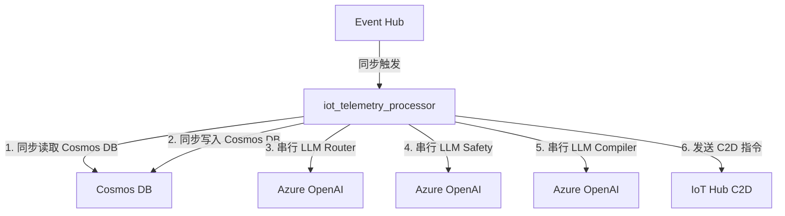
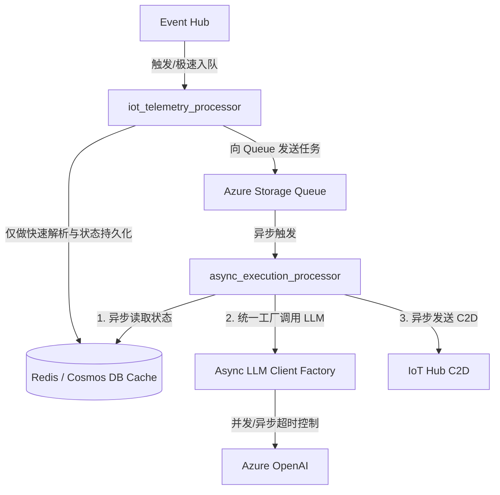

# Project-OmniGuard 架构重构与修改计划

本报告旨在评估 DeepSeek 架构审计报告的合理性，补充审计中未涉及的潜在架构漏洞，并制定详细的重构与修改计划。

---

## 一、 DeepSeek 审计报告合理性评估

经过对代码库的深入静态分析，我们对 DeepSeek 报告的 3 个红线问题 and 6 个附加发现进行了逐一评估：

### 1. 红线 1：状态解耦 — **基本合理，但有细节偏差**
* **本地缓存问题** (`kol_analysis/cache_manager.py`)：**完全合理**。在多实例的 Azure Functions (Consumption Plan) 场景下，实例会随时被创建和回收，且实例间不共享本地文件系统。使用本地文件进行缓存会导致严重的缓存不一致和重复的 AI 调用费用。
* **Cosmos DB 连接获取** (`embodied_brain/brain.py:52`)：**部分合理，但有偏差**。DeepSeek 认为 `get_cosmos_container()` 每次都会重新创建连接。实际上该方法使用全局变量 `_cosmos_container` 进行了 Lazy-load 兜底，并没有在每次写入时都创建新连接。但这种设计依然存在线程安全隐患，且在主 I/O 路径中进行**同步阻塞调用**非常致命。
* **高并发协调**：**完全合理**。对于 IoT 遥测高频刷入场景，直接用 Cosmos DB 承载状态孪生读写，其响应延迟与 RU 成本不可控。应引入 Redis 作为高性能缓冲/状态机。

### 2. 红线 2：吞吐压测 — **完全合理**
* **串行 LLM 调用** (`brain.py`)：**完全合理**。3 次 LLM 同步串行调用（Intent Router -> Safety Firewall -> Action Compiler），总延迟一般在 3~6s 以上。作为 EventHub 触发的处理函数，这会严重降低消费吞吐率，并极大增加超时熔断的风险。
* **缺乏超时与重试控制** (`utils.py:96`, `router.py:78`)：**完全合理**。未配置 `timeout` 会导致在大模型接口响应慢或连接挂起时，底层线程/协程被永久阻塞。

### 3. 红线 3：去 AI 化注释 — **完全合理**
* **业余术语修辞**：**完全合理**。代码中充斥着诸如 `[⚡️ 物理下行] 动作序列已砸回探针电机`、`动态神经元系统`、`建立底层神经丛连接` 等非工业级的浮夸词汇。这些注释不仅影响代码的专业度，还为后续维护人员带来理解障碍。必须统一使用精确、动词驱动的工程化描述（例如 `Write/Read/Send/Receive/Cache`）。

### 4. 附加发现 A-F — **完全合理**
* **凭证泄露** (`kol_analysis/config.py`)：**严重安全违规，必须优先解决**。X.com 敏感 token 和 Cookie 已经提交至 Git。
* **三套独立的 LLM 客户端**：**完全合理**。三个不同的文件构建了三套客户端，使用了不同的环境变量命名，这在运维和部署时是一个巨大的隐患。
* **零测试覆盖**：**完全合理**。核心的设备安全规则判定和 Action 生成全无单元测试。
* **同步 EventHub 触发器阻塞**：**完全合理**。EventHub 触发的 Function 如果阻塞时间过长，会导致租约丢失、分区消费停滞以及消息重复处理。
* **Git 卫生**：**完全合理**。构建缓存 `.next/`、`out/` 以及 IDE 配置 `.idea/` 应当被加入 `.gitignore` 并从仓库中清理。

---

## 二、 补充审计与架构隐患（DeepSeek 遗漏点）

在评估过程中，我们发现了以下 DeepSeek 未能指出的潜在漏洞：

1. **Cosmos DB 客户端初始化缺乏线程安全锁**：
   * `utils.py` 中的 `get_cosmos_container()` 进行 Lazy-load 时，没有加线程锁 (`threading.Lock`)。在多线程高并发调用下，可能会瞬间创建多个客户端实例，失去单例连接池的作用。
2. **Cosmos DB `read_item` 异常过于宽泛**：
   * `brain.py:38-42` 中对读取上一次状态的异常处理使用了 `except Exception: pass`。如果数据库发生短暂网络波动或权限认证失败，程序会将其误判为“无上一次历史状态”，从而导致安全规则判定失准。应当仅捕获 `CosmosResourceNotFoundError` (404)，其他异常则需要抛出并记录警告。
3. **大模型 JSON 输出格式缺乏硬性保证**：
   * Action Compiler 在 Stage 4 依然依赖字符串截取和 LLM 自身的“乖顺度”来输出 JSON 数组。一旦 LLM 输出包含多余废话，`json.loads()` 将会崩溃。应采用 Azure OpenAI 的 `response_format={"type": "json_object"}` 或者是结构化输出 (Structured Outputs) 来强制保证输出格式。
4. **硬编码的 GraphQL Query ID**：
   * `kol_analysis/config.py` 中的 `QUERY_ID = "hr4gzZONlq23okjU8fIe_A"` 是硬编码的。如果 Twitter API 更新了其 GraphQL 端点的 Query ID，爬虫会立刻瘫痪，应设计更具弹性的配置读取或注入方案。

---

## 三、 架构改造目标与方案

### 1. 架构流向重构设计 (Refactored Flow)

重构前：

重构后（引入异步 I/O、统一 Factory、Redis 缓存与队列解耦方案）：

---

## 四、 重构修改计划 (Step-by-Step Action Plan)

### 阶段 1：安全与规范应急响应（优先级 1 - 即刻执行）
* **任务 1.1: 凭证剥离**
  * 修改 [config.py](file:///Users/liushengwei/project/PythonProject/Project-OmniGuard/src/cloud-orchestrator/kol_analysis/config.py)，删除硬编码的 `cookies`、`headers` 中的 Bearer token。
  * 将这些配置抽取为环境变量（在云端写入 App Settings，在本地写入 [local.settings.json](file:///Users/liushengwei/project/PythonProject/Project-OmniGuard/src/cloud-orchestrator/local.settings.json)）。
  * 建议废除现有的被泄露 token，重新在 X.com 申请新凭据。
* **任务 1.2: Git 卫生清理**
  * 更新 [.gitignore](file:///Users/liushengwei/project/PythonProject/Project-OmniGuard/.gitignore)，将 `.next/`、`out/`、`.idea/`、`daily_cache/` 显式忽略。
  * 执行 `git rm -r --cached` 清除已被提交的构建缓存和 IDE 目录。
* **任务 1.3: 注释去 AI 化**
  * 修改 [brain.py](file:///Users/liushengwei/project/PythonProject/Project-OmniGuard/src/cloud-orchestrator/embodied_brain/brain.py)、[router.py](file:///Users/liushengwei/project/PythonProject/Project-OmniGuard/src/cloud-orchestrator/digitalhuman/router.py) 和 [device_mock.py](file:///Users/liushengwei/project/PythonProject/Project-OmniGuard/src/cloud-orchestrator/edge-simulator/device_mock.py)，移除夸张的词汇，替换为纯技术工程化术语。

### 阶段 2：客户端统一与健壮性提升（优先级 2 - 建议首先修改代码逻辑）
* **任务 2.1: 统一 LLM Client Factory**
  * 创建 `src/cloud-orchestrator/common/llm_factory.py`，提供统一的客户端创建机制。
  * 统一使用一组标准的环境变量（推荐 `AZURE_OPENAI_ENDPOINT`、`AZURE_OPENAI_API_KEY`、`AZURE_OPENAI_DEPLOYMENT_NAME`）。
  * 支持异步 (`AsyncAzureOpenAI`) 与同步 两种客户端。
* **任务 2.2: LLM 调用超时、重试与结构化输出配置**
  * 为所有 LLM 调用增加超时保护参数（例如 `timeout=5.0`）。
  * 在 Action Compiler 中引入结构化输出配置，保证返回格式的安全性。
  * 在 `utils.py` 的 Cosmos DB 初始化方法中加入线程锁，防范并发初始化漏洞。
  * 细化 Cosmos DB 的 `read_item` 异常处理逻辑，精确捕获 `CosmosResourceNotFoundError`。

### 3. 阶段 3：架构高可用与性能重构（优先级 3 - 建议在核心链路测试完成后进行）
* **任务 3.1: 缓存由本地迁移至分布式层**
  * 改造 `DailyCacheManager`，支持通过环境变量切换缓存后端。当检测到生产环境时，利用 Redis 或者是 Cosmos DB 的高速缓存表代替本地的 `daily_cache/` 文件存储。
* **任务 3.2: 事件流处理异步化解耦**
  * 方案 A（平滑改动）：将 `iot_telemetry_processor` 改为 `async def`，使用 `aiohttp` 和 `AsyncAzureOpenAI` 进行异步并发调用，并将 3 次串行 LLM 限制在更紧凑的超时范围内。
  * 方案 B（终极重构）：将 `EventHubMessageTrigger` 与 LLM 业务逻辑剥离。EventHub Trigger 仅负责快速解析遥测数据、更新设备状态快照（写入 Redis / Cosmos DB），然后向 Azure Queue Storage 写入任务消息。另起一个 Queue Trigger 函数异步处理重试、LLM 编排与 C2D 指令下发，从而实现高吞吐解耦。

### 4. 阶段 4：自动化测试与质量保障（优先级 4 - 伴随重构过程）
* **任务 4.1: 构建单元测试框架**
  * 创建 `tests/` 目录，安装 `pytest`。
  * 为核心代码（例如 `generate_sas_token`、LLM Client Factory、Safety Firewall 判定规则、Action 格式校验）编写基础测试用例。
  * 通过 GitHub Actions 配置 CI 流程，执行自动化测试验证。
