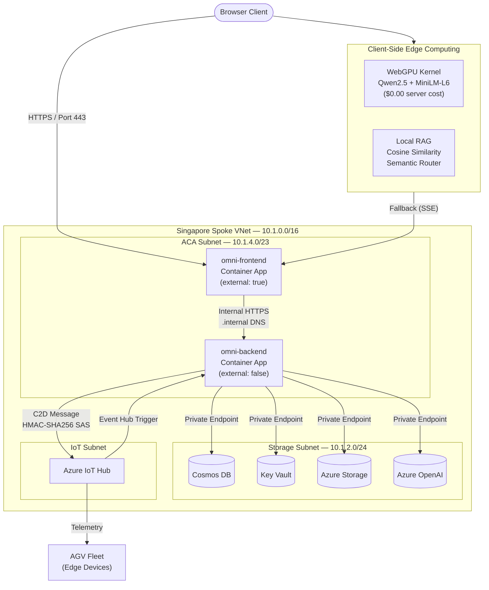

# Project-OmniGuard

**Cloud-Edge Collaborative Security Orchestrator · Zero-Trust Sandbox · Kinematic-Token Theorem Prover**

[](https://azure.microsoft.com/en-us/products/container-apps/)
[](https://nextjs.org/)
[](https://fastapi.tiangolo.com/)
[](https://azure.microsoft.com/en-us/products/iot-hub/)
[](https://www.w3.org/TR/webgpu/)
[]()
[](LICENSE)

---

**Project-OmniGuard** is an enterprise-grade cloud-edge collaborative security decision-making platform. It proves a core research thesis — the **Kinematic-Token Theorem** — that cloud-only LLM inference latency creates a physical safety deadlock for embodied AI fleets, and demonstrates a multi-layered defense architecture combining **Zero-Trust network isolation**, **Multi-Agent AI orchestration with early circuit-breaking**, and **WebGPU edge inference** to solve it.

> **Research Contribution:** Formal proof that cloud LLM response time ($T_{cloud} = T_{network} + T_{prompt} + T_{generation}$) exceeds the kinematic braking distance of AGVs at operational speeds, necessitating a hybrid edge-cloud cognitive pipeline.

---

## 🏗️ Architecture Overview



---

## 🌟 Core Technical Highlights

### 1. Zero-Trust Network Security Perimeter

| Layer | Implementation | Evidence |
|:------|:---------------|:---------|
| **API Gateway (CORS-free)** | Next.js App Router [catch-all route handler](src/client-edge/src/app/api/) dynamically proxies backend requests, eliminating CORS and obscuring private backend paths | BFF Pattern |
| **Complete Backend Cloaking** | FastAPI container runs as VNet-internal only (`external: false`), invisible from public internet. Communication uses Azure internal private DNS (`.internal`) | `compute-module.bicep` |
| **Private Link Endpoints** | 4 independent Private Endpoints for Cosmos DB, Key Vault, Azure Storage, and Azure OpenAI. All public access disabled | `nested-infra.bicep` |
| **Managed Identity (Passwordless)** | User-Assigned Managed Identity + Key Vault RBAC + Cosmos DB role assignment. Zero hardcoded credentials | `nested-infra.bicep` L124-L160 |
| **NSG Micro-segmentation** | Bidirectional NSG rules: Deny Internet Inbound + Allow Backend Only to Storage Subnet | `network-rules.json` |
| **Hub-Spoke VNet Topology** | Subscription-level Bicep deployment with isolated subnets for compute, storage, and IoT | 3-layer modular IaC |

### 2. Multi-Agent AI Orchestration Engine (3-Agent Pipeline)

A production-grade multi-agent pipeline processes IoT telemetry through three specialized agents with **early circuit-breaking** to minimize LLM token costs:

```
IoT Telemetry
    │
    ▼
┌─────────────────────────────────────────────────────────┐
│ Physical Short-Circuit Layer                            │
│   HP ≤ 0 → offline_lock         (skip all agents)      │
│   Battery < 5% → emergency_halt (skip all agents)      │
└─────────────┬───────────────────────────────────────────┘
              │
              ▼
    ┌─────────────────┐
    │ Agent 1: Router  │ ──── Intent Classification
    │ (20 tokens max)  │      [CRITICAL_OBSTACLE | NORMAL_NAV | SENSOR_ERROR]
    └────────┬────────┘
             │ SENSOR_ERROR? → STOP (skip remaining agents)
             ▼
    ┌─────────────────┐
    │ Agent 2: Safety  │ ──── Compliance & Risk Audit
    │ (50 tokens max)  │      Evaluates $500K AGV tipping risk
    └────────┬────────┘
             │ BLOCK? → safety_override (skip compiler)
             ▼
    ┌─────────────────┐
    │ Agent 3: Compiler│ ──── Action Compilation
    │ (100 tokens max) │      Outputs JSON action sequence
    └────────┬────────┘
             │
             ▼
    C2D Message → Device Motor
```

- **Multi-tenant scenario registry**: Per-tenant agent prompts, safety rules, and action schemas (`scenario_registry.json`)
- **Digital Twin persistence**: Device state upserted to Cosmos DB on every telemetry event (partitioned by `tenant_id`)
- **Cloud metrics instrumentation**: Per-agent latency tracking (`agent_1_latency_ms`, `agent_2_latency_ms`, `agent_3_latency_ms`, Cosmos R/W latency)

### 3. IoT Full-Duplex Data Pipeline

- **Upstream**: Azure IoT Hub → Event Hub Compatible Endpoint → Functions EventHubTrigger → Agent Pipeline
- **Downstream**: Agent Pipeline → C2D Message via HMAC-SHA256 SAS Token (hand-crafted, not SDK wrapper) → Device Motor
- **Device Mock Simulator**: Python-based edge device simulator for local development (`edge-simulator/`)

### 4. Kinematic-Token Theorem — Research Contribution

The Fleet Dashboard proves that **cloud LLM response time exceeds AGV braking distance at operational speeds**, through four interactive modes:

| Dashboard Route | Purpose | Backend Dependency |
|:---|:---|:---|
| `/dashboard/theorem` | Single-AGV kinematic proof sandbox | None (pure frontend physics) |
| `/dashboard/compare` | Side-by-side cloud vs edge comparison | None |
| `/dashboard` | 3-AGV fleet simulation (Cloud-Only / Cloud+Edge / Token-Breakdown) | None |
| `/dashboard/live` | Live cloud integration with real Azure OpenAI latency | Azure Functions + Cosmos DB |

**Key physics**: Step-based detection loop with configurable jitter, network latency, and LLM token breakdown sliders. Demonstrates that a 15ms edge brake beats a 2600ms+ cloud-only response.

### 5. Hybrid Edge-Cloud Cognitive Pipeline (WebGPU)

| Pipeline | Technology | Cost | Use Case |
|:---------|:-----------|:-----|:---------|
| **Edge (Pipeline A)** | WebGPU + Qwen2.5-0.5B-Instruct + Xenova/MiniLM-L6-v2 | **$0.00** server compute | High-frequency greetings, local RAG retrieval |
| **Cloud (Pipeline B)** | Azure OpenAI (SSE streaming) via VNet-internal FastAPI | Per-token pricing | Complex queries exceeding local knowledge boundary |

The semantic router uses **cosine similarity** (threshold ≥ 0.72) to classify whether a query can be answered locally. Sub-threshold queries fall back seamlessly to the Singapore cloud backend via SSE streaming.

### 6. IaC Visual Configurator & Scenario Assembler

An interactive **Infrastructure-as-Code configuration dashboard** (`/iac/configurator`) that:

- Visually configures VNet CIDR ranges, SKU pricing tiers, managed identity toggles, and deployment regions
- Generates and assembles Bicep templates from scenario presets (`sandbox` / `secure-iot`)
- Renders interactive **Bicep topology diagrams** with module-level drill-down navigation
- Exports downloadable IaC deployment packages (`.zip`)
- Runs **Bicep preflight compilation** (`az bicep build`) to guarantee 100% ARM template correctness before deployment
- Maintains **automated backup rotation** (max 5 backups with scenario-aware naming)

### 7. Shadow Environment E2E Test Suite

A self-healing end-to-end test that validates the **entire Zero-Trust infrastructure** in an isolated shadow environment:

1. **Deploy**: Provisions a complete shadow resource group with overwritten prefix (`omnitest`)
2. **Audit**: Validates Private DNS A records point to correct StorageSubnet IPs (`10.1.2.x`), verifies ACA container health status
3. **Self-Heal**: Automatically destroys shadow resource group (async `--no-wait`) + cleans temp parameter files
4. **Signal Safety**: Handles `Ctrl+C` interrupts with guaranteed teardown to prevent cost leakage

### 8. KOL Prediction & Supply Chain Intelligence

An AI-powered investment research pipeline (`/prediction`) that:

- Scrapes Twitter/X KOL tweets with pagination
- Runs **batch bilingual translation** (CN ↔ EN) via Azure OpenAI
- Generates **supply chain bottleneck analysis**, conviction watchlists, and value chain mappings
- Visualizes hot topics, industry breakdowns, and tweet timelines with configurable time windows

### 9. Digital Human AI Assistant

A context-aware streaming avatar with **route-sensitive system prompts**:

- Detects the user's current page (`/`, `/resume`, `/canvas`) and dynamically adjusts the LLM's persona
- Serves SAS-authenticated private blob assets (60-second expiry tokens)
- Streams responses via SSE with `X-Accel-Buffering: no` for zero-latency delivery

---

## 📁 Repository Structure

```text
├── .azure/                         # Infrastructure-as-Code (IaC)
│   ├── main.bicep                  # Subscription-level deployment orchestrator
│   ├── nested-infra.bicep          # VNet + Private Link + NSG + Key Vault + Managed Identity
│   ├── compute-module.bicep        # Frontend & Backend Container Apps + Log Analytics
│   ├── network-rules.json          # NSG bidirectional security rules
│   └── templates/                  # Scenario-specific Bicep template presets
├── scripts/                        # Operational Automation
│   ├── deploy-aca.sh               # Zero-cache Docker build → ACR push → ACA rolling update
│   ├── provision.sh                # Idempotent infrastructure provisioning
│   ├── provision-whatif.sh         # Dry-run deployment preview
│   ├── destroy.sh                  # Full resource group teardown
│   ├── iac-assembler.py            # Scenario-driven Bicep template assembler with backup rotation
│   ├── preflight-validate.py       # Azure-side preflight deployment validation
│   ├── trigger-ci.sh               # GitHub CI/CD pipeline trigger
│   └── add-device.sh               # IoT Hub device identity registration
├── src/
│   ├── client-edge/                # Next.js 14 Frontend (App Router)
│   │   └── src/
│   │       ├── app/
│   │       │   ├── page.tsx                # Interactive resume / landing page
│   │       │   ├── dashboard/              # Fleet simulation & live telemetry dashboards
│   │       │   │   ├── theorem/            # Kinematic-Token Theorem single-AGV sandbox
│   │       │   │   ├── compare/            # Side-by-side cloud vs edge proof
│   │       │   │   └── live/               # Real cloud integration dashboard
│   │       │   ├── prediction/             # KOL supply chain intelligence console
│   │       │   ├── iac/                    # IaC topology viewer & configurator
│   │       │   └── api/[...path]/          # Catch-all API gateway proxy (BFF pattern)
│   │       ├── components/
│   │       │   ├── digital-human/          # AI avatar with WebGPU kernel
│   │       │   │   └── kernel.ts           # Edge compute: Qwen2.5 + MiniLM-L6 + RAG
│   │       │   └── canvas/                 # Bicep topology visualization
│   │       └── workers/                    # Web Workers for Bicep parsing
│   └── cloud-orchestrator/         # FastAPI Backend (Azure Functions ASGI)
│       ├── function_app.py         # ASGI entrypoint with modular router registration
│       ├── embodied_brain/         # Multi-Agent orchestration engine
│       │   ├── brain.py            # 3-Agent pipeline + IoT Event Hub trigger
│       │   └── utils.py            # Cosmos DB, SAS token signing, Agent wrapper
│       ├── digitalhuman/           # Context-aware LLM streaming router
│       ├── kol_analysis/           # KOL tweet analysis & prediction API
│       ├── edge-simulator/         # IoT device mock for local development
│       └── scenario_registry.json  # Multi-tenant agent configuration
├── tests/
│   └── shadow-e2e-test.py          # Self-healing shadow environment E2E test (287 lines)
├── docs/                           # Diátaxis-Compliant Documentation
│   ├── adrs/                       # 33 Architecture Decision Records
│   ├── dashboard/                  # Fleet Dashboard reference & presentation scripts
│   ├── audits/                     # Architecture audit reports
│   ├── reference/                  # System design blueprints
│   └── tutorials/                  # Quickstart deployment guides
└── Makefile                        # Unified command bus (12 targets)
```

---

## 🛠️ Quick Start

```bash
# Terminal 1: Launch backend (Azure Functions host, port 7071)
make start-backend

# Terminal 2: Launch frontend (Next.js, port 3000)
make start-frontend
```

### Deployment

```bash
# Dry-run infrastructure changes
make whatif

# Provision Azure infrastructure (idempotent)
make provision

# Build & deploy containers (zero-cache, forced revision)
make deploy-aca

# Run shadow E2E test (deploy → audit → self-heal destroy)
python tests/shadow-e2e-test.py
```

---

## 📐 Architecture Decision Records (33 ADRs)

All significant engineering decisions are documented in [ADR format](docs/adrs/INDEX.md), organized by concern domain:

| Domain | Count | Key Decisions |
|:-------|:-----:|:--------------|
| ☁️ Cloud Infrastructure | 8 | VNet routing, SKU migration, Shadow E2E, ACA ingress POST demotion |
| ⚙️ Backend | 6 | Pure ASGI migration, tenant fallback, dynamic orchestration API |
| 🎨 Frontend | 13 | Step-based detection loop, Fleet simulation, Token breakdown control, Ref-based physics |
| 🏗️ Cross-Domain Architecture | 10 | Shared physics kernel, Generation counter, Dual-mode architecture, Multi-agent engine |

---

## 🎓 Research & Academic Relevance

This project addresses the intersection of **cybersecurity**, **embodied AI safety**, and **cloud-edge computing**:

- **Zero-Trust Architecture**: Enterprise-grade Private Link + VNet isolation + Managed Identity — applicable to critical infrastructure protection
- **AI Safety & Alignment**: Multi-agent pipeline with safety firewall agent that can **BLOCK** unsafe actions before they reach physical actuators
- **Edge Computing Security**: WebGPU-based local inference protects user privacy while reducing attack surface (no data leaves the browser)
- **Formal Verification**: Kinematic-Token Theorem provides mathematical proof of cloud-only AI control deadlocks
- **Infrastructure Security Testing**: Shadow E2E test suite validates Private DNS resolution and network isolation integrity

---

## 🏅 Certifications (Author)

| Certification | Description |
|:---|:---|
| **AZ-305** | Azure Solutions Architect Expert |
| **AZ-104** | Azure Administrator Associate |
| **AI-102** | Azure AI Engineer Associate |
| **SC-300** | Microsoft Identity and Access Administrator |
| **AB-100** | Agentic AI Business Architect |

---

## 📜 License

[MIT License](LICENSE) — Liu Shengwei