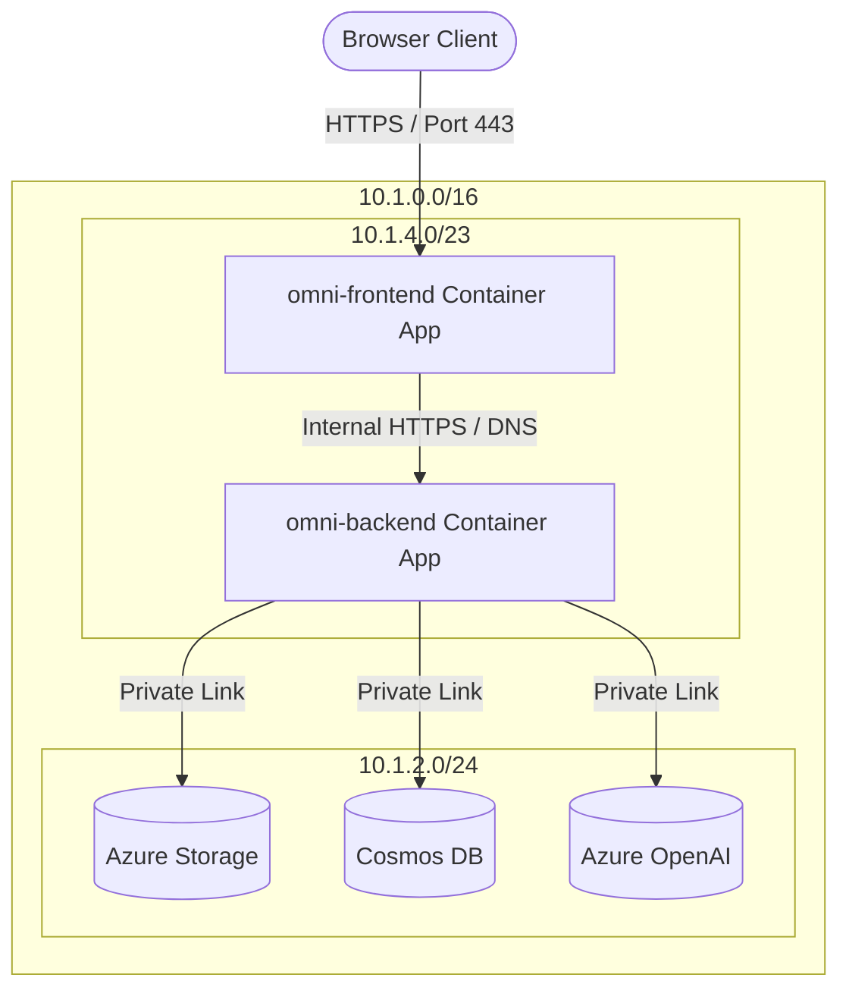

# Project-OmniGuard: Cloud-Edge Collaborative Security Orchestrator & Zero-Trust Sandbox

[](https://azure.microsoft.com/en-us/products/container-apps/)
[](https://nextjs.org/)
[](https://fastapi.tiangolo.com/)
[](LICENSE)

**Project-OmniGuard** is an enterprise-grade cloud-edge collaborative security decision-making sandbox. It acts as both a network routing and status-monitoring shield for embodied IoT device fleets operating at hostile perimeters, and a reference architecture built on **Azure Container Apps (ACA)**, **Private Virtual Networks (VNet)**, and **Azure Private Link** enforcing zero-trust data compliance.

---

## 🌟 Key Technical Highlights & Architectural Pillars

### 1. Zero-Trust Network Perimeter & Micro-segmentation
* **API Gateway Defense (CORS-free):**  
  The public Next.js frontend container (`external: true`) acts as a secure **API Gateway**, dynamically proxying backend API requests through App Router's **[catch-all route handler](file:///Users/liushengwei/project/PythonProject/Project-OmniGuard/src/client-edge/src/app/api/[...path]/route.ts)** to avoid CORS issues and obscure private backend paths.
* **Complete Backend Cloaking:**  
  The backend FastAPI container is configured as VNet-internal only (`external: false`), completely hidden from the public internet. Communication between frontend and backend is routed strictly over Azure internal private DNS (`.internal`) inside the Singapore spoke subnet.
* **Internalized Cloud Endpoints (Private Link):**  
  Decommissioned all public endpoint access to Cosmos DB, Storage Account, and Azure OpenAI Service using four independent **Private Endpoints**. All data traffic flows exclusively over private subnets, securing compute-to-storage paths.

### 2. Hybrid Edge-Cloud AI Reasoning Pipeline
* **Local WebGPU In-Browser Inference ($0.00 Server Compute):**  
  High-frequency user greetings and local vector matching (RAG) are processed directly inside the client's browser using **WebGPU** (Xenova/all-MiniLM-L6-v2 + Qwen2.5-Instruct). This protects user privacy and reduces cloud backend inferencing costs to absolute zero.
* **Cloud Stream Fallback (SSE):**  
  If the local semantic router determines that the query falls outside local knowledge limits, it seamlessly fallbacks to the cloud backend. The frontend proxy forwards the request to the private FastAPI worker, streaming response tokens (Server-Sent Events) from Azure OpenAI.

### 3. Real-Time Telemetry Sandbox
* Visualizes active edge device fleet metrics (HP, Battery, Velocity, Temp) with network jitter/latency sliders.
* Renders the dynamic cloud network topology flowchart and multi-agent orchestration states, providing transparency of inference steps.

---

## 📁 System Repository Structure

```text
├── .azure/                     # Infrastructure-as-Code (IaC) Templates
│   ├── main.bicep              # Subscription-level deployment orchestrator
│   ├── nested-infra.bicep      # Network infrastructure & Private Link configuration
│   └── compute-module.bicep    # Frontend & Backend Container Apps configuration
├── sh/                         # Operational Scripts
│   ├── deploy-aca.sh           # Cache-busting compilation, push, and rolling update trigger
│   ├── provision.sh            # Idempotent cloud infrastructure provisioning trigger
│   └── start-backend.sh        # Local backend Functions emulator startup
├── src/                        # Service Source Code
│   ├── client-edge/            # Next.js frontend & dynamic API router proxy
│   └── cloud-orchestrator/     # Python FastAPI ASGI worker inside Functions container
│       ├── daily_cache/        # Persistent offline tweets scraping cache
│       └── run_analysis.py     # Batch tweets scraper, translator & investor RAG analyzer
├── Makefile                    # Unified command execution bus
└── docs/                       # Diátaxis-compliant Documentation Directory
```

---

## 🌐 Network Topology Flowchart



---

## 🛠️ Operational Runbook & Developer Workflow

### 1. Spin Up Local Development
Launch backend and frontend services in separate local terminals:
```bash
# Terminal 1: Launch local Functions Host emulator (port 7071)
make start-backend

# Terminal 2: Launch local Next.js frontend (port 3000)
make start-frontend
```

### 2. Run Offline Tweets Harvesting & AI RAG Analysis
Scrape tweets, run batch translations, and perform AI supply-chain analysis locally:
```bash
make research
```

### 3. Deploy to Cloud (Bypassing Docker & Container Registry Cache)
Containers are hosted inside a private subnet and referenced by the `:latest` tag. To force deployments to bypass Docker caching and force ACA to pull updated images:
```bash
make deploy-aca
```
*This command runs a `--no-cache` Docker compilation, pushes the image to ACR, and pollutes the Container App's environment variables with `TRIGGER_VERSION=$(date +%s)` to force Azure to retire the old replica and start a new revision.*

---

## 🎯 Troubleshooting & Lessons Learned (Nourishment for Growth)

* **Subnet Delegation Lock (`InUseSubnetCannotBeUpdated`):**  
  Legacy Functions VNet integrations locked the `BackendSubnet` delegation. Fixed by running `az resource delete` to explicitly delete the old App Service Plan and free the locks.
* **ACR Registry Bootstrapping Cold-Start:**  
  Fresh deployments fail with `MANIFEST_UNKNOWN` when Container Apps start before ACR contains the image. Solved by placing a public dummy image (`aci-helloworld`) in Bicep first, and then deploying the actual image over it.
* **308 Trailing Slash POST-to-GET Method Stripping:**  
  Next.js `trailingSlash: true` forced a 308 redirect for non-slashed API requests. Browsers followed the redirect by dropping the method to `GET`, triggering a 405 Method Not Allowed in FastAPI. Resolved by appending trailing slashes in all client-side calls and changing `BACKEND_API_URL` to `https://` to bypass HTTP-to-HTTPS Envoy redirect method stripping.
* **Path Assembly Slashes:**  
  Catch-all routing evaluated `/api/chat/stream/` into segments ending with an empty string, creating `chat/stream/` which failed FastAPI routing. Resolved by filtering empty segments using `pathSegments.filter(Boolean).join('/')` in `route.ts`.

---

## 📚 Diátaxis Documentation Index

* 📖 **[Migration & Troubleshooting Retrospective](file:///Users/liushengwei/project/PythonProject/Project-OmniGuard/docs/migration_retrospective_aca.md)**: Exhaustive details on Container Apps, VNet routing details, and SWA-vs-ACA decisions.
* 📐 **[System Design Blueprints](file:///Users/liushengwei/project/PythonProject/Project-OmniGuard/docs/reference/system-integration-design.md)**: Architectural schemas for fleet routing and proof-of-cloud validation.
* 🚀 **[Quickstart Deployment Guide](file:///Users/liushengwei/project/PythonProject/Project-OmniGuard/docs/tutorials/quickstart.md)**: Step-by-step setup guides for developers.
