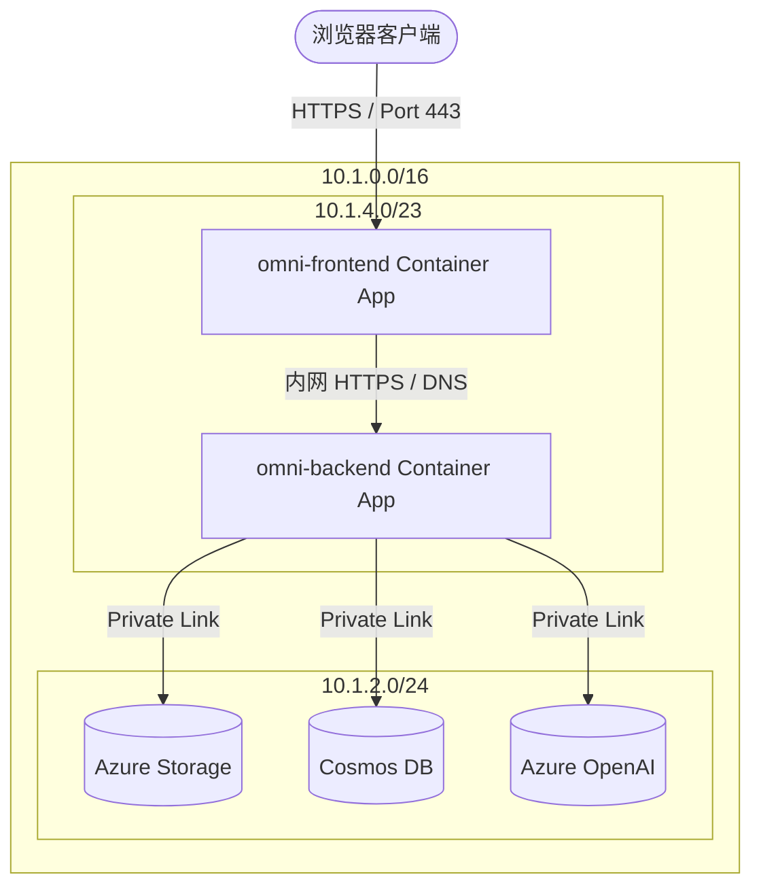

# Project-OmniGuard: 云边一体化 Agent 协同沙盘与零信任容器化架构

[](https://azure.microsoft.com/en-us/products/container-apps/)
[](https://nextjs.org/)
[](https://fastapi.tiangolo.com/)
[](LICENSE)

**Project-OmniGuard** 是一款企业级云边协同网络安全决策沙盘系统。它既是具身智能（Embodied AI）机队在极端恶劣网络边界下的状态监测与路由防线，也是一套基于 **Azure Container Apps (ACA)**、**专有虚拟网络 (VNet)**、与 **Azure Private Link** 构建的极致零信任（Zero-Trust）云上基础架构参考实现。

---

## 🌟 核心技术亮点与架构支柱

### 1. 零信任网络隔离安全拓扑 (Zero-Trust Network Perimeter)
* **API 网关防线 (API Gateway Pattern):**  
  前端 Next.js 独立运行于公网（`external: true`），利用 App Router 的 **[捕获性动态路由](file:///Users/liushengwei/project/PythonProject/Project-OmniGuard/src/client-edge/src/app/api/[...path]/route.ts)** 在 Node.js 运行时担任反向代理网关，从而规避前端跨域（CORS）问题并混淆私有后端路由。
* **物理私密隔离 (Backend Cloaking):**  
  后端容器常驻进程（FastAPI + Functions Host）设置为内网独占（`external: false`），**对公网完全不可见**。前/后端数据交换完全依靠新加坡子网的专有内网 DNS (`.internal`) 进行毫秒级安全加密通信。
* **内网端点合拢 (Private Link):**  
  对大模型（Azure OpenAI）、数据库（Cosmos DB）、以及存储（Azure Storage），拉起 4 个独立的 **Private Endpoint（私网端点）**，彻底切断外网流量，实现计算节点到云服务端的纯内网安全闭环。

### 2. 云边混合双通道认知管线 (Hybrid Edge-Cloud Cognitive Pipeline)
* **本地 WebGPU 显存加速 (Zero-Cost Inference):**  
  在数字人交互中，通过 WebGPU API 在浏览器就地拉起 HuggingFace Transformers 特征提取模型与本地知识库，在客户端以 **$0.00 服务端算力开销** 本地解算高频交互与 RAG 检索，保障用户绝对隐私。
* **新加坡内网 ASGI 级联 (Cloud Stream Fallback):**  
  当本地开发判定超出边界时，请求无缝滑向云端，通过前端 API 网关代理穿透至新加坡私网内的 FastAPI ASGI 实例，调用 Azure OpenAI 产生流式（SSE）大模型应答响应。

### 3. 实时可视化决策沙盘 (Fleet Telemetry Console)
* 提供具身智能 IoT Telemetry 控制台，提供网络抖动（Jitter）、延迟（Latency Spike）与碰撞日志的实时物理渲染与逻辑决策通路追踪。
* 动态绘制云端拓扑图（Cloud Topology Flowchart）和 Agent 编排流水线（Orchestration Pipeline），实现网络边界与大模型推理进度的透明化呈现。

---

## 📁 系统源码与拓扑结构

```text
├── .azure/                     # 基础设施即代码 (IaC) 模板库
│   ├── main.bicep              # 订阅级部署指挥官 (新加坡主战场)
│   ├── nested-infra.bicep      # 专有虚拟网络 (VNet) 与私网端点 (Private Link) 蓝图
│   └── compute-module.bicep    # 前后端 Azure Container Apps (ACA) 与服务注入蓝图
├── sh/                         # 自动化运维工具箱
│   ├── deploy-aca.sh           # 前后端容器无缓存自动化编译、推送与云端强制滚动升级脚本
│   ├── provision.sh            # 零摩擦幂等基础设施一键部署引信
│   └── start-backend.sh        # 本地 Functions 宿主开发环境拉起脚本
├── src/                        # 核心业务源码
│   ├── client-edge/            # Next.js 前端 (App Router / force-dynamic / 网关代理)
│   └── cloud-orchestrator/     # FastAPI Python 后端 (包裹于 Functions ASGI 底座中)
│       ├── daily_cache/        # 离线投研抓取数据持久化目录
│       └── run_analysis.py     # 推文抓取、批量翻译与 AI 投研分析离线计算引线
├── Makefile                    # 统一项目控制命令总线
└── docs/                       # 系统Diátaxis规范文档库 (ADR/Operations/Tutorials)
```

---

## 🌐 架构拓扑流向图



---

## 🛠️ 快速上手与操作指南 (Runbook)

### 1. 本地联调环境拉起
在本地分别打开两个终端，分别执行后端和前端服务：
```bash
# 终端 1：启动本地 Python Functions 宿主服务 (监听端口 7071)
make start-backend

# 终端 2：启动前端 Next.js 边缘服务 (监听端口 3000)
make start-frontend
```

### 2. 离线推文采集与投研 AI 分析
本地运行分析脚本以抓取最新大 V 增量推文，并通过 AI 完成批量翻译与供应链卡脖子分析：
```bash
make research
```

### 3. 一键编译与云端极速热部署 (零缓存设计)
由于容器服务部署在虚拟网络中且 Tag 恒定为 `:latest`，为规避 Docker 和云端 Revision 缓存，部署流水线已全自动优化。只需一行命令：
```bash
make deploy-aca
```
*该脚本会自动以 `--no-cache` 编译前/后端镜像，推送到私有 ACR，并通过污染环境变量 `TRIGGER_VERSION` 强制拉起新的容器 Revision 以拉取最新镜像和数据快照。*

---

## 🎯 迁移期间的关键避坑与排查手册

我们在将项目由原先的 `Static Web Apps + Serverless Functions` 架构迁移至 `Container Apps + VNet` 的过程中，记录并合拢了以下关键避坑实录：

* **子网整合委派锁 (Subnet Delegation Lock):**  
  旧 SWA/Functions 绑定的 VNet 整合强行锁定了子网的委派权限，导致 Bicep 在重新调配 IP 段时抛出 `InUseSubnetCannotBeUpdated`。排查方案是直接通过 CLI 命令 `az resource delete` 强力移除旧版遗留的 App Service Plan，释放占位锁后方可重新部署。
* **ACR 镜像冷启动悖论 (ACR Bootstrapping):**  
  首次拉起计算资源时，ACR 镜像仓库为空，导致 Bicep 部署容器因拉不到镜像报错 `MANIFEST_UNKNOWN`。我们在 IaC 模板中使用微软公网极简镜像 `aci-helloworld` 作为占位符引导，跑通基础网络后，再用真实业务镜像进行无缝覆盖。
* **308 重定向与 POST 方法退化 (Method Stripping):**  
  Next.js 前端路由在配置 `trailingSlash: true` 时，会将不带斜杠的 POST 请求重定向至带斜杠的地址。在此过程中，浏览器 Fetch 引擎会默认将 `POST` 改变/降级为 `GET` 请求发送给内网，被后端拒绝。排查后，我们补齐了前端的所有接口尾随斜杠，并修改 `BACKEND_API_URL` 为 `https://` 以越过内网 Envoy 的 HTTP-to-HTTPS 重定向劫持，彻底解决了 405 Method Not Allowed 故障。
* **Path 路径空白占位切片:**  
  Next.js 的 App Router 会将带有斜杠的 `/api/chat/stream/` 分割为包含空字符串的数组，导致还原路径时变成带有斜杠的 `/api/chat/stream/`，引发 FastAPI 路由不匹配（405）。我们在前端网关中通过 `pathSegments.filter(Boolean).join('/')` 对其进行了过滤规整。

---

## 📚 延伸阅读地图 (Diátaxis Map)

* 📖 **[架构迁移与调试深度复盘白皮书](file:///Users/liushengwei/project/PythonProject/Project-OmniGuard/docs/migration_retrospective_aca.md)**：包含关于 ACA 运行时、网桥技术细节、故障剖析与场景选型决策指南的超详尽分析。
* 📐 **[系统架构设计蓝图 (Blueprints)](file:///Users/liushengwei/project/PythonProject/Project-OmniGuard/docs/reference/system-integration-design.md)**：包含本沙盘的云上环境验证设计、机队数据路由设计等系统核心图纸。
