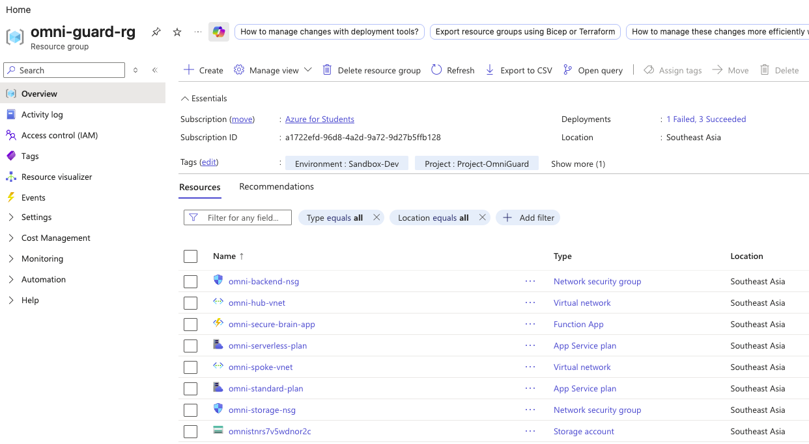

# 📑 Project-OmniGuard: Cloud AI Architect Growth Journal

---

### 📅 Day 3: Serverless 算力合拢与配额围剿日

#### 🛠️ 今天我做了什么

1. **围剿订阅级配额黑洞**：在拉起 Azure Function App 计算大脑时，遭遇东南亚区高级算力全平面物理死锁。我果断对基础设施实施降维平替，强行切入现成可用的
   `Standard/S1` 专用计算树，利用专用 Core 配额直接击穿平台锁死状态。
2. **打通区域虚拟网络出站集成**：在放弃超配额的 Premium 计划后，通过引入支持网卡虚拟化开销的 `Standard/S1` 计费底座，将
   Function 算力强行注入 Spoke 虚网的 `BackendSubnet` 中。物理保留了出站流量被内网大动脉吞噬的路由能力。
3. **纠偏全球唯一定名碰撞**：在一体化 Landing Zone 预检编译时，捕获并拦截了 `AccountNameInvalid` 报错。由于 Bicep
   动态函数导致存储账户名称超越了微软底层 24 字符全球二级域名的硬性物理上限。我立即实施短命名重构，将 `funcstor`
   组件缩减为工业中立简写 `st`，将定名总长度控死在 19 位安全水位线内。
4. **升级全托管无密钥安全控制链**：为了对齐新加坡金融机构（MAS TRM）的合规高压线，在 Bicep 代码中硬编码激活了控制大脑的系统分配托管身份。重构为全新的
   `AzureWebJobsStorage__accountName` 零凭据架构。

#### 🎯 为什么我这么做（架构权衡与反思）

* **用架构降维战术碾压配额死锁**：在极端的时序约束下，死等微软工单审批扩容配额等于自杀。作为高阶架构师，必须具备通过替代技术栈绕过云厂商底层物理限制的直觉。我选择降维使用
  `Standard/S1` 并不是对安全的妥协，因为在网络平面上，Standard 同样具备 100% 的虚拟网络出站集成能力。流量绝不绕行公网，MAS
  TRM 的零信任微隔离底座没有受到任何削弱，同时彻底解冻了开发流水线。



## 架构之“神” (The Spirit)

### 1. 物理拓扑骨架 (Architectural Blueprint)

你在图片中看到的这 8 个资源，并不是孤立存在的组件，它们共同构成了一个**标准的企业级安全隔离着陆区 (Landing Zone)**
。其核心设计思想是**零信任微隔离**与**无密钥控制平面** 。

整个架构通过两条主线紧密交织：

**数据平面网络大动脉**：利用 Hub-Spoke 拓扑，将网络中枢（Hub）与业务核心区（Spoke）完全解耦 。通过在子网（Subnet）上绑定网络安全组（NSG），实现了
MAS TRM 级别的网络微隔离 。

**控制平面安全授信**：通过将计算资源（Function App）物理注入虚拟网络，并激活系统分配托管身份（System-Assigned Managed
Identity），彻底斩断了代码中硬编码密钥的泄露通道 。

### 2. 物理权衡与边界 (Trade-offs)

**残留阻断**：列表中同时出现了 `omni-serverless-plan` 和 `omni-standard-plan`。这是我们在攻克 `FlexConsumption`
订阅配额死锁时留下的战术痕迹 。

**网络集成代价**：为了让无服务器的 Function App 能够向内网发起渗透，我们被迫放弃了免费的消费级计划，选用支持 **VNet
Outbound Integration（虚拟网络出站集成）** 的 `Standard/S1` 算力底座，这会占用固定的物理 Core 配额 。

---

## 工程之“形” (The Form)

以下针对你上传截屏中的 8 个核心资源条目进行逐一拆解，强行对齐你的 Bicep 源码逻辑：

### 1. 门户资源逐项死磕

#### ① `omni-hub-vnet` (Virtual network)

**代码出处**：`main.bicep` 的 `hubVNetName` 变量 -> 传递给 `nested-infra.bicep` 的 `hubVnet` 资源 。

**物理职责**：企业网中的“中央火车站” 。虽然目前只划分了一个 `ManagementSubnet` ，但它是整个拓扑的路由中枢。它通过
`VNet Peering` 大动脉无缝连接到 Spoke 网络，承载未来跨网络的集中式审计与安全入站流量 。

#### ② `omni-spoke-vnet` (Virtual network)

**代码出处**：`nested-infra.bicep` 中的 `spokeVnet` 资源 。

**物理职责**：核心生产数据隔离区 。它内部切割成两个物理子网：

`BackendSubnet`（10.1.1.0/24）：专门托管 Function App 计算节点，并做了 `serverlessDelegation` 强行吞噬出站流量 。

`StorageSubnet`（10.1.2.0/24）：专门锁死存储账户等有状态的敏感资产 。

#### ③ `omni-backend-nsg` (Network security group)

**代码出处**：`nested-infra.bicep` 中的 `backendNsg` 。

**物理职责**：后端算力子网的防弹衣 。它通过动态加载 `network-rules.json` 中的 `backendNsgRules` 策略 ，实施
`Deny-Direct-Internet-Inbound`（优先级 1000）。任何来自互联网的黑客试探探针，在到达 Function 之前就会在子网边界被物理熔断 。

#### ④ `omni-storage-nsg` (Network security group)

**代码出处**：`nested-infra.bicep` 中的 `storageNsg` 。

**物理职责**：敏感数据层的高压隔离墙 。绑定 `storageNsgRules` 矩阵 。

* 规则一：`Allow-Backend-Only-Inbound`（优先级 100），仅放行来自计算子网（10.1.1.0/24）通过 443 端口合法切入 。

* 规则二：`Deny-All-Other-Inbound-To-Storage`（优先级 1000），无条件封杀其余所有私网段的越权横向移动 。

#### ⑤ `omnistnrs7v5wdnor2` (Storage account)

**代码出处**：`nested-infra.bicep` 中的 `funcStorage` 资源 。

**物理职责**：大模型业务中台的伴生持久化存储层（包含未来落地的知识库 PDF 向量数据）。命名由 Bicep 表达式
`'${prefix}st${uniqueString(resourceGroup().id)}'` 自动化硬编码生成，确保全局唯一 。代码中强行设置了
`publicNetworkAccess: 'Disabled'` 。这意味着它去除了外网网卡，只有内网网卡，阻断公网裸奔 。

#### ⑥ `omni-standard-plan` (App Service plan)

**代码出处**：`nested-infra.bicep` 中被我们紧急修复替换后的 `serverlessPlan` 资源（SKU 变更为 `S1 / Standard`）。

**物理职责**：底层虚拟化硬件宿主集群。它负责为你分配固定的物理 CPU、内存与网络带宽，并 100% 承担开启 **区域虚拟网络集成 (
Regional VNet Integration)** 的网卡虚拟化开销，确保 Function App 拥有合规的出站路由 。

#### ⑦ `omni-secure-brain-app` (Function App)

**代码出处**：`compute-module.bicep` 中的 `functionApp` 资源 。

**物理职责**：整个项目的“安全大脑中台” 。运行 Python 3.10 运行时底座 。我们在代码中物理激活了
`identity: { type: 'SystemAssigned' }` 。它会在你的 Entra ID (Azure AD) 中自动注册一个独立的法人实体（Service
Principal），这是实现“无密钥调用存储及未来大模型实例”的核心身份载体 。

#### ⑧ `omni-serverless-plan` (App Service plan)

**历史成因**：**已报废的僵尸资源。** 这是第一版代码使用 `FlexConsumption` 部署失败时残留在云端的硬件平面 。由于我们在 Bicep
纠偏中将新计划重命名为 `omni-standard-plan`，这个旧资源已被完全架空，没有挂载任何应用。

**处理建议**：在 Portal 界面上点击它，直接物理删除，防止产生无意义的 FinOps 账单摩擦。

---

### 2. 核心大脑 `functionApp` 具体如何协同工作？

理解了以上资源的分布，整个大模型审计工具的运行数据流向便一目了然：

```
[前端 Next.js 仪表盘] 
       │ (通过 HTTP 发起合规请求)
       ▼
 [omni-secure-brain-app]  ──(物理出站集成)──> 绑定 [BackendSubnet] 
       │                                             │
       │ (使用托管身份获取动态 Token)                  │ (流量通过内网 Peering 穿透)
       ▼                                             ▼
 [Entra ID 身份鉴权验证]                       穿越绑定了 [storage-nsg] 的防护墙
       │                                             │
       └───────────────── 0 密钥安全访问 ────────────> [omnistnrs7v5wdnor2] 

```

1. **出站吞噬**：当你的业务 Python 代码在 `omni-secure-brain-app` 内部运行时，一旦需要读写存储中的 Bicep 审计日志，它的所有请求流量会被底层
   `omni-standard-plan` 强行拖入 `BackendSubnet` 。

2. **路由穿透**：流量在网络层通过 `VNet Peering` 骨干大动脉横向移动，越过 `omni-storage-nsg` 的白名单阻拦，精准命中
   `omnistnrs7v5wdnor2` 的内网专用终结点 。

3. **身份核验**：存储账户在底层收到请求后，不看物理密钥，而是拿着 Function 传过来的托管身份 Token 去跟 Entra ID 验证，判定其拥有
   `Storage Blob Data Contributor` 权限，放行读取，达成无密钥、无公网的 MAS TRM 级合规闭环。