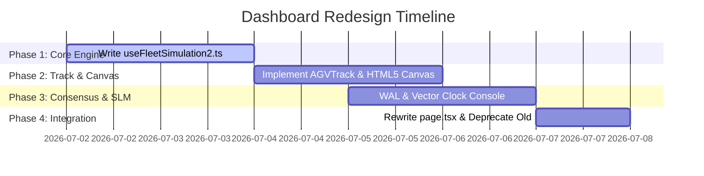

# Dashboard Redesign — Fleet Kinematic Control Plane (Optimized & Academic-Fused Edition)
# Dashboard 重构方案 — 智能舰队级运动学控制面（学术融合优化版）

---

## 1. Why Redesign / 重构的核心价值

**The current dashboard has a credibility problem.**
原有的 Dashboard（以 [page.tsx](file:///Users/liushengwei/project/PythonProject/Project-OmniGuard/src/client-edge/src/app/dashboard/page.tsx) 为主）由于运行的是黑盒的 Intent Router → Safety Firewall → Action Compiler 这 3-Agent 逻辑，导致语义不透明，演示者往往需要花两分钟来解释它和物理运动学沙盒（[/kinematic](file:///Users/liushengwei/project/PythonProject/Project-OmniGuard/src/client-edge/src/app/kinematic/page.tsx)）的关系。一个出色的 Demo 应当在 5 秒内实现自我解释。

本优化方案将 Dashboard 直接重塑为 **“运动学-Token 定理”（Kinematic-Token Theorem）在舰队级多智能体场景下的物理验证平台**。

### 1.1 核心优势与学术价值
* **物理-网络理论融合（Cyber-Physical Systems）**：将控制环路网络延时（$L_{total} = L_{network\_rtt} + \frac{Tokens}{TokenRate}$）与物理刹车安全边界（$V_{agv} \le D / L$）深度缝合，可视化推演 Embodied AI 物理动作的安全包络（Safety Envelope）。
* **System 1 vs System 2（双系统架构）**：将 Edge Guardian 抽象为低延时反射性的 System 1 神经网络/规则；将 Cloud Commander 抽象为高智能但高延时的 System 2 大语言模型规划器。
* **脑裂收敛与分布式共识（CAP 定理应用）**：利用本地 Write-Ahead Log（WAL）与向量钟（Vector Clocks）展示在暗仓网络分区（Network Partition）恢复后，物理安全决策如何强制覆盖过期云端决策的收敛流程。
* **100% 纯前端仿真运行**：消成了对后端 Function API 的强制依赖，确保学术答辩、商业演示、面试现场 100% 可靠、零成本且离线可用。

---

## 2. Design Principles / 设计原则

| 原则 | 物理与工程含义 |
|---|---|
| **单一叙事故事线** | 界面上的每个元素都应强化“延时与小模型性能决定车辆物理安全”这一命题 |
| **无障碍自解释 Agent** | 云端指挥官（Cloud Commander）、边缘守护者（Edge Guardian）与硬件急刹（Emergency Brake）的职责一目了然 |
| **沙盒理论舰队化扩展** | 它是 [/kinematic](file:///Users/liushengwei/project/PythonProject/Project-OmniGuard/src/client-edge/src/app/kinematic/page.tsx) 定理验证的扩展，两者在数学公式与物理运动逻辑上严格镜像同步 |
| **多轨渲染严格同步** | 3个 AGV 轨道共用同一个 `requestAnimationFrame` 驱动，防止长期运行时产生浏览器帧数漂移 |

---

## 3. Architecture & Scenarios / 新系统架构与演示场景

### 3.1 3-Agent 物理安全防线

| 智能体 / Agent | 物理角色 | 典型延时 (Latency) | 物理对应 |
|---|---|---|---|
| **☁️ Cloud Commander** | 高智商全局路径规划 | 500ms – 30000ms | LLM 大模型长周期决策 |
| **⚡ Edge Guardian** | 边缘低时延安全校验 | 10ms – 100ms | 边缘 SLM / 规则，检测到障碍则介入 |
| **🛑 Emergency Brake** | 硬件级急停断电保护 | 1ms – 15ms | 电机微控制器，常驻守护 |

### 3.2 三轨舰队并行物理特征

* **AGV-01: "Cloud-Dependent"（纯云端控制）**  
  配置：`cloudLatencyMs = 5000`，`edgeLatencyMs = N/A (Disabled)`。  
  预期物理结果：**💥 撞墙（Crash）**。云端指令未到达时，小车已物理滑行穿过安全 clearance 边界。
* **AGV-02: "Cloud + Edge"（云边协同与小模型降级）**  
  配置：`cloudLatencyMs = 3000`，`edgeLatencyMs = 20ms`。  
  预期物理结果：**🛡️ 安全刹停或慢速滑行**。在网络分区或严重延时下，边缘小模型/规则拦截并安全介入。
* **AGV-03: "Edge-Only (WAL Sync)"（纯边缘离线共识）**  
  配置：`cloudLatencyMs = Offline`，`edgeLatencyMs = 15ms`。  
  预期物理结果：**💾 离线记录与重新同步**。进入网络暗区，所有物理状态写入本地 WAL，网络恢复时触发向量钟冲突消解日志输出。

### 3.3 演示场景配置矩阵 (Scenario Presets)

在 [scenarios.ts](file:///Users/liushengwei/project/PythonProject/Project-OmniGuard/src/client-edge/src/app/dashboard/config/scenarios.ts) 中定义如下预设场景：

1. **Normal Ops (正常运作)**：全链路低时延。三车全部安全无虞，云端控制顺畅。
2. **Cloud Spike (云端延时暴涨)**：云端 RTT 飙升至 5000ms。AGV-01 瞬间撞墙；AGV-02 依靠 Edge Guardian 成功刹停。
3. **Network Partition (网络分区)**：云端断网。AGV-02 切换至 **Local SLM Fallback** 模式（智力降级，以 0.2m/s 超低安全车速避障前行）；AGV-03 触发离线 WAL 记录。
4. **Reconnection Sync (重连一致性同步)**：网络恢复。AGV-03 自动触发 WAL 同步，在控制台展示向量钟（Vector Clocks）冲突消解，并以“物理急停指令”覆盖“云端恢复前进指令”。

---

## 4. Component Hierarchy / 组件树重构规划

```text
FleetDashboard (page.tsx)
├── FleetHeader
│   ├── Navigation Links (/kinematic, /kinematic/compare)
│   ├── Fleet Status Badge (Active / Degraded / WAL_Syncing)
│   └── Fleet Latency Gauge (Aggregated Max/Min)
│
├── FleetControlPanel (Scenario & Master Parameters)
│   ├── Scenario Selector Buttons
│   ├── Master Speed Slider (agvSpeedMps)
│   ├── Master Clearance Slider (clearanceM)
│   └── Play / Pause / Reset All Controls
│
├── FleetTrackView (3-Column Layout)
│   ├── AGVTrackGroup (Canvas / SVG Engine for 3 Tracks)
│   │   ├── AGVTrack (AGV-01: Cloud-Dependent)
│   │   ├── AGVTrack (AGV-02: Cloud + Edge)
│   │   └── AGVTrack (AGV-03: Edge-Only)
│   └── AgentPipelineOverlay (Right Visual Block)
│       ├── Active Agent Node State Glow (Cloud / Edge / Hardware Brake)
│       └── System 1/2 Path Routing Visual Lines
│
└── FleetAuditPanel (Bottom Telemetry Terminal)
    ├── WALSyncConsole (Simulated IndexedDB WAL entries & Vector Clocks Sync)
    └── AuditTerminalConsole (Chronological physics & override event logs)
```

### 4.1 引入与移除的组件对比

* **移除组件**：
  * `PhysicalTwinVisualizer`：已合并到多轨 Canvas 轨道视图中。
  * `CloudTopologyFlowchart`：与运动学-延时定理的叙事无关，予以剔除。
  * `SandboxPanel`：不再需要在 Dashboard 页面覆盖 Prompt 参数（移入局部控制抽屉）。
  * `AgentOrchestratorFlow`：升级为 `AgentPipelineOverlay`，强化云、边、硬急刹三层时延判定。
* **保留与升级组件**：
  * `InfraTelemetryPanel`：简化为舰队平均/最高延时与 CPU/NPU 状态监测。
  * `AuditTerminalConsole`：重构以输出带时间戳的舰队级事件、脑裂 WAL 向量钟冲突合并序列。

---

## 5. Implementation Roadmap / 分阶段实施路径



### 5.1 实施明细

* **第一阶段：核心引擎重构**
  * 编写新的 `useFleetSimulation2.ts` 状态钩子。定义 3 组带有延时状态的变量，通过单一 `requestAnimationFrame` 驱动。
  * 在 [kinematic.ts](file:///Users/liushengwei/project/PythonProject/Project-OmniGuard/src/client-edge/src/app/kinematic/lib/kinematic.ts) 中导出核心刹车距离计算。
* **第二阶段：画布与 HUD 绘制**
  * 编写 `AGVTrack.tsx`。使用 Canvas 绘制车道、车辆和阻挡墙。
  * 并在车辆与墙体之间动态绘制红色高亮区域，即**物理无法刹停区（Red Zone）**。
* **第三阶段：分布式共识与模型降级演示**
  * 编写 `WALSyncConsole.tsx`，在右侧侧边栏高亮显示网络断开期间在客户端缓存的状态包队列。
  * 编写向量钟比较算法，确保重连一瞬间控制台输出详细的学术级冲突消解链路。
* **第四阶段：页面整合与回归清理**
  * 修改 [page.tsx](file:///Users/liushengwei/project/PythonProject/Project-OmniGuard/src/client-edge/src/app/dashboard/page.tsx)，使用全新布局组件，删除被取代的组件文件。
  * 在未开启后端 Function App 状态下启动页面，全面测试 4 个演练场景的物理模拟行为是否正确无误。
