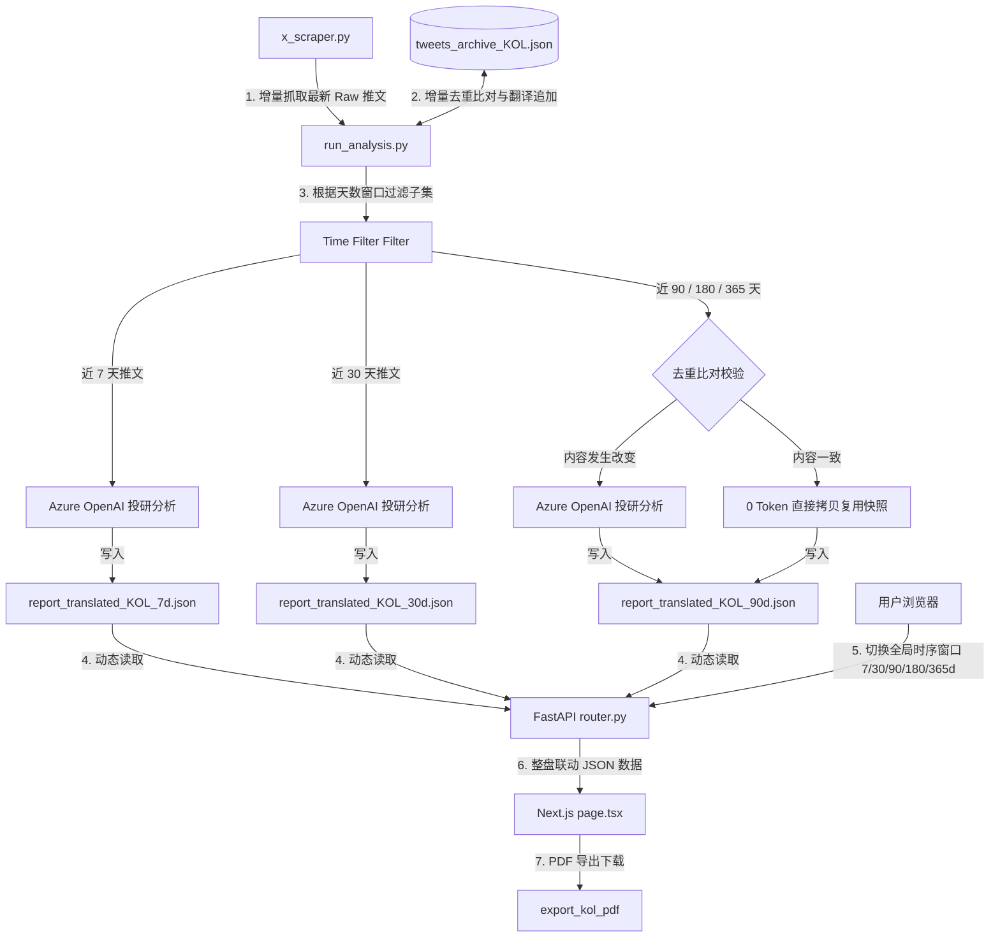

# Project-OmniGuard 投研看板系统重构规范与操作指南
*(Project-OmniGuard Redesign Specification & Run Guide)*

---

## 一、 5W2H 投研看板重构决策分析

我们使用行业通用的 **5W2H 分析模型** 对 Project-OmniGuard 本次架构优化进行系统化解构：

| 维度 | 核心定义 | 投研看板系统应用落地细节 |
| :--- | :--- | :--- |
| **What (是什么)** | 优化目标与内容 | **时序数据归档 + 多尺度投研报告快照 + 前端全局过滤联动 + 安全凭证剥离** 的完整架构重构。 |
| **Why (为什么)** | 重构原因与痛点 | 1. 解决原大盘分析写死“近 7 天”导致前端无法整体联动过滤的痛点。<br/>2. 解决 X.com 敏感凭证在代码库中硬编码暴露的严重安全隐患。<br/>3. 避免大模型重复调用造成的 Token 资金浪费与无状态环境下的文件缓存失效。 |
| **Who (谁执行/受益)**| 利益相关人与角色 | 1. **开发/运维人员**：通过前后端解耦和统一 Factory 大大降低后续云端部署与改动成本。<br/>2. **投资分析师 (Shengwei)**：享受零封号风险、秒级整盘联动筛选的丝滑投研体验。 |
| **When (何时运行)** | 运行周期与生命周期 | 1. **日常数据采集**：每天本地或云端增量运行，耗时极短。<br/>2. **配置更新**：每隔 1~2 个月（Cookie 失效时）本地一键点击书签更新，秒级自愈。 |
| **Where (何处运行)** | 空间部署与组件结构 | 1. **数据归档层**：缓存目录下的原始时序归档文件（后续可无缝迁移至 Cosmos DB 容器）。<br/>2. **API 服务层**：Azure Functions (FastAPI Router) 接收配置并动态返回特定天数快照。<br/>3. **UI 看板层**：基于 Next.js App Router 的纯净前端看板页面。 |
| **How (如何运行)** | 操作指令与执行手段 | 1. **抓取翻译分析**：通过 `RANGE_DAYS` 和 `FORCE_REFRESH` 环境变量运行 [run_analysis.py](file:///Users/liushengwei/project/PythonProject/Project-OmniGuard/src/cloud-orchestrator/run_analysis.py) 进行动态生成。<br/>2. **安全更新**：使用浏览器一键书签 (Bookmarklet) 无缝将最新凭证 POST 给云端接收端点。 |
| **How much (多少成本)**| 大模型 API 消耗控制 | **理论极限低消耗**：增量翻译打包（15条仅消耗1次调用）；大天数窗口比对去重（内容一致时 0 额外总结调用），日常更新一般仅调用 **3 次** OpenAI 服务。 |

---

## 二、 行业标准数据流设计 (Data Flow Architecture)

本重构方案严格遵循了现代分布式系统和大数据领域的几项**行业技术规范与标准设计模式**：

1. **Lambda 架构解耦标准 (Lambda Architecture)**：批处理与流式处理分离。遥测流极速入库，大模型分析等慢 I/O 任务采用异步/按需生成的方式解耦，保障高吞吐率。
2. **时序数据湖归档规范 (Time-series Data Archiving Standard)**：将外部推文作为 Immutable Event Log（不可变时序日志）进行扁平化追加归档（[tweets_archive.json](file:///Users/liushengwei/project/PythonProject/Project-OmniGuard/src/cloud-orchestrator/daily_cache/tweets_archive_1940360837547565056.json)），提供完整的数据回溯能力，以便未来采用其他分析模型重算。
3. **单向数据流与无状态表现组件规范 (Stateless UI / Presenter Pattern)**：前端将主页面 [page.tsx](file:///Users/liushengwei/project/PythonProject/Project-OmniGuard/src/client-edge/src/app/prediction/page.tsx) 设为核心状态机，将所有的具体图形、时间线渲染等解耦为 `prediction/components/` 文件夹下的纯无状态组件（Pure Component），实现职责单一和高复用性。

### 重构后整体数据流向图 (Mermaid Data Flow)



---

## 三、 系统修改后命令行调用手册 (Run & Command Guide)

由于底层架构变更为归档与多尺度分析，对应的运行与调试命令也有所调整。请参考以下命令在本地或云端进行操作：

### 1. 本地增量更新大盘（日常运行）
默认生成 `7d`、`30d` 等多个分析快照文档，增量翻译并更新时序推文归档：
```bash
make research
```
*(提示：该命令在内部执行 `python run_analysis.py`，默认抓取 30 天，并智能复用未变动窗口的分析，极其省钱。)*

### 2. 强刷历史数据（填补 6 月 15 日 - 22 日等旧推文空洞）
当您发现历史数据由于限流存在断档，需要向前补全历史并重构所有多天数报告快照时，请运行：
```bash
FORCE_REFRESH=true RANGE_DAYS=30 make research
```
* **`FORCE_REFRESH=true`**：开启强刷模式，使程序跳过增量缓存拦截，一路翻页向上。
* **`RANGE_DAYS=30`**（或更多，例如 `90`）：设置采集截止阈值，确保能深入捞回更早期的原始推文。

---

## 四、 核心重构代码位置索引

若您后续需要扩展或微调特定功能，可以直接点击以下 clickable 链接定位到相应文件：

* 🚀 **采集与分析引擎**：[run_analysis.py](file:///Users/liushengwei/project/PythonProject/Project-OmniGuard/src/cloud-orchestrator/run_analysis.py) （负责加载归档、按天数窗口过滤、智能比对去重、调用大模型生成多份报告）。
* 📂 **数据湖归档**：[tweets_archive_1940360837547565056.json](file:///Users/liushengwei/project/PythonProject/Project-OmniGuard/src/cloud-orchestrator/daily_cache/tweets_archive_1940360837547565056.json) （扁平化存储，只记录推文 id、时间、原文和中译文，可随时用于其他 AI 模型或库的加工）。
* 📡 **后端路由 API**：[router.py](file:///Users/liushengwei/project/PythonProject/Project-OmniGuard/src/cloud-orchestrator/kol_analysis/router.py) （支持根据传入的 `range_days` 加载对应快照报告及导出 PDF 报告）。
* 🖥️ **前端逻辑主页面**：[page.tsx](file:///Users/liushengwei/project/PythonProject/Project-OmniGuard/src/client-edge/src/app/prediction/page.tsx) （精简状态机，管理全局 `timeFilter` 时间窗口与 API 异步请求）。
* 🎨 **无状态渲染副组件集**：位于 `prediction/components/` 目录下：
  - [Header.tsx](file:///Users/liushengwei/project/PythonProject/Project-OmniGuard/src/client-edge/src/app/prediction/components/Header.tsx)（顶部栏，集成全局时序窗口选择器与 PDF 导出触发）。
  - [AnalysisCharts.tsx](file:///Users/liushengwei/project/PythonProject/Project-OmniGuard/src/client-edge/src/app/prediction/components/AnalysisCharts.tsx)（大盘与行业占比柱状/环形图绘制，小数位已精准控制为 2 位）。
  - [TweetTimeline.tsx](file:///Users/liushengwei/project/PythonProject/Project-OmniGuard/src/client-edge/src/app/prediction/components/TweetTimeline.tsx)（推文时序列表纯渲染展示）。
