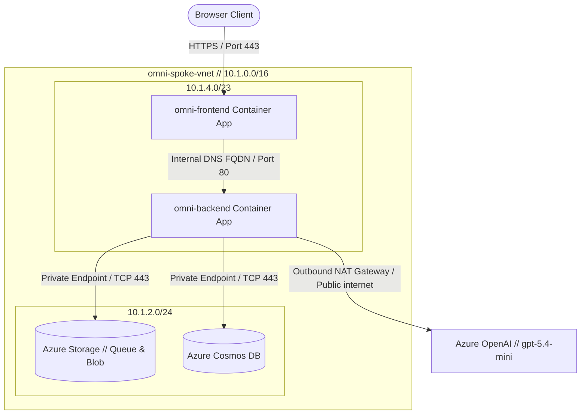
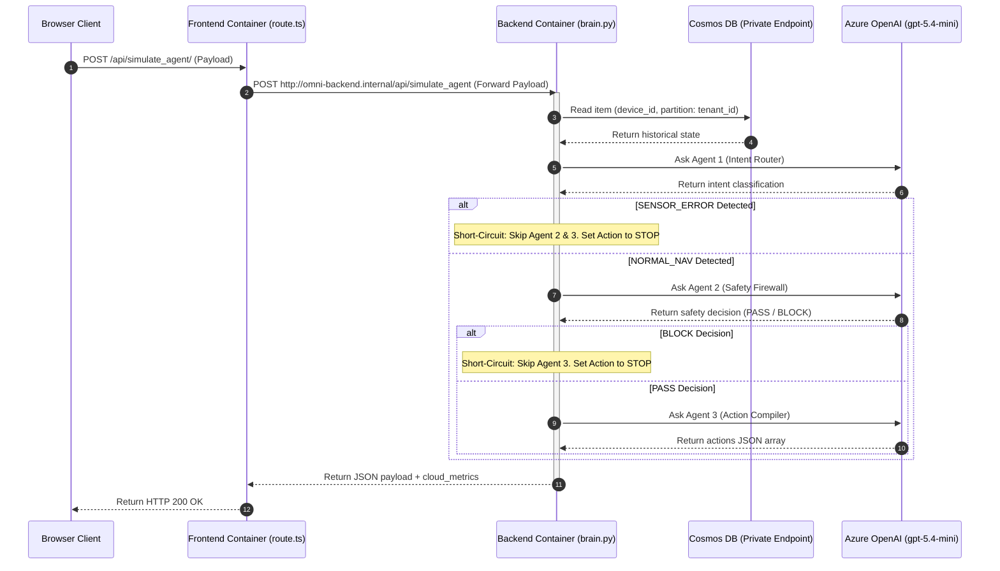

# System Blueprint: Fleet Dashboard Control Plane
# 系统蓝图：边缘车队控制面总设计

> **Document Status**: Active (System Constitution / 法典)
> **Target**: Physical topology, telemetry routing paths, sequence diagrams, and API schemas.
> **Metric Bounds**: Target latency < 2.5s, stateless HTTP/1.1 transactions, VNet subnet isolation.

---

## 1. Architecture Topology / 物理节点拓扑

The control plane is deployed inside a dedicated Virtual Network (Singapore Spoke VNet) using Container Apps.



### Component Boundaries
* **`omni-frontend`**: Public-facing container. Runs the Next.js runtime, serving static assets and proxying API traffic.
* **`omni-backend`**: Private container (`external: false`). Exposes FastAPI routes internally inside the virtual network.
* **Private Link Interceptor**: Restricts database and storage traffic to private IP addresses. Public access to Cosmos DB and Storage accounts is disabled.

---

## 2. Sequence Diagram / 数据时序图

The diagram below details the synchronous telemetry processing and agent decision sequence:



---

## 3. API Contracts / 接口契约

### Endpoint
* **Address**: `POST /api/simulate_agent/`
* **Transport**: Stateless HTTP/1.1 over TLS.

### Request JSON Schema
```json
{
  "$schema": "http://json-schema.org/draft-07/schema#",
  "type": "object",
  "properties": {
    "tenant_id": { "type": "string" },
    "obstacle_distance_cm": { "type": "integer", "minimum": 0 },
    "current_x": { "type": "integer" },
    "target_speed": { "type": "integer", "minimum": 10, "maximum": 100 }
  },
  "required": ["tenant_id", "obstacle_distance_cm", "current_x"]
}
```

### Response JSON Schema
```json
{
  "$schema": "http://json-schema.org/draft-07/schema#",
  "type": "object",
  "properties": {
    "latency_ms": { "type": "integer" },
    "final_action": {
      "type": "array",
      "items": {
        "type": "object",
        "properties": {
          "action": { "type": "string" },
          "speed": { "type": "integer" },
          "reason": { "type": "string" }
        },
        "required": ["action"]
      }
    },
    "pipeline_trace": {
      "type": "array",
      "items": {
        "type": "object",
        "properties": {
          "agent": { "type": "string" },
          "decision": { "type": "string" },
          "status": { "type": "string", "enum": ["PASS", "BLOCKED", "SHORT_CIRCUIT", "COMPILED"] }
        },
        "required": ["agent", "decision"]
      }
    },
    "cloud_metrics": {
      "type": "object",
      "properties": {
        "cosmos_db_ru_charge": { "type": "number" },
        "cosmos_write_latency_ms": { "type": "number" }
      },
      "required": ["cosmos_db_ru_charge", "cosmos_write_latency_ms"]
    }
  },
  "required": ["latency_ms", "final_action", "pipeline_trace", "cloud_metrics"]
}
```
