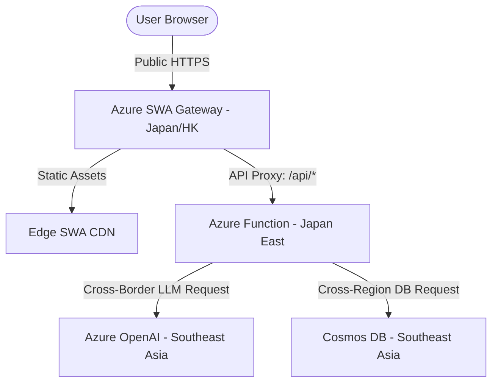
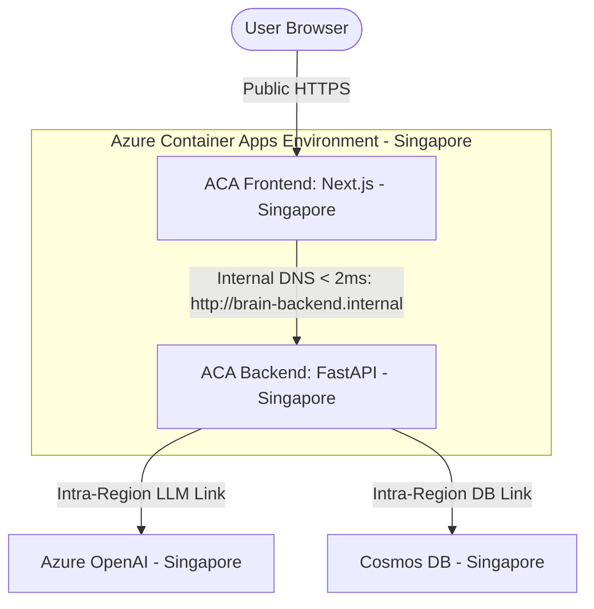

# Azure Container Apps (ACA) Migration Plan

This document outlines the step-by-step technical plan to migrate the **Project-OmniGuard** Next.js frontend and FastAPI backend from Azure Static Web Apps (SWA) + Azure Functions (Japan East) to **Azure Container Apps (ACA)** in the **Southeast Asia (Singapore)** region. 

This migration physically co-locates the compute resources with the Azure OpenAI endpoints, solves the Python single-threaded SSL handshake performance bottleneck on throttled serverless nodes, and eliminates cold starts.

---

## 🗺️ 1. Architecture Topology Comparison

### Before Migration: Distributed SWA + Standalone Functions (Multi-Region Hop)

* **Bottlenecks**: SWA proxy latency, cross-border network routing, cold starts, and CPU throttling on Functions Consumption plan.

### After Migration: Regionally Co-located Azure Container Apps (Southeast Asia)

* **Benefits**: 100% regional alignment, sub-millisecond internal routing, dedicated CPU cores, and zero cold starts (via warm replicas).

---

## 📦 2. Backend Containerization (FastAPI)

Since `function_app.py` already exposes a standard `fastapi_app` instance (with CORS middleware pre-configured), we can directly host it as a standalone Python web service using `uvicorn`.

### A. Backend Dockerfile (`src/cloud-orchestrator/Dockerfile`)
Create this Dockerfile inside `src/cloud-orchestrator/`:

```dockerfile
# Use official lightweight Python image
FROM python:3.11-slim

WORKDIR /app

# Install system dependencies (required for some Python network packages)
RUN apt-get update && apt-get install -y --no-install-recommends \
    build-essential \
    && rm -rf /var/lib/apt/lists/*

# Copy requirements and install
COPY requirements.txt .
RUN pip install --no-cache-dir -r requirements.txt
RUN pip install --no-cache-dir uvicorn

# Copy application source code
COPY . .

# Expose FastAPI default port
EXPOSE 8000

# Start server using uvicorn (referencing fastapi_app in function_app.py)
CMD ["uvicorn", "function_app:fastapi_app", "--host", "0.0.0.0", "--port", "8000"]
```

### B. Requirements file (`src/cloud-orchestrator/requirements.txt`)
Ensure these packages are present:
```text
fastapi>=0.100.0
azure-cosmos>=4.4.0
azure-functions>=1.15.0
openai>=1.0.0
python-dotenv>=1.0.0
```

---

## 🖥️ 3. Frontend Containerization (Next.js Standalone)

To optimize Next.js for production container environments, we enable `standalone` output compilation. This creates a highly optimized node server that bundles only the required files, cutting the image size down by up to 80%.

### A. Next.js Config Update (`src/client-edge/next.config.mjs`)
Enable standalone output format in the configuration:

```javascript
/** @type {import('next').NextConfig} */
const nextConfig = {
  output: 'standalone', // <--- Add this line to bundle Next.js as a standalone server
  // ... rest of your existing nextConfig
};

export default nextConfig;
```

### B. Frontend Dockerfile (`src/client-edge/Dockerfile`)
Create this multi-stage Dockerfile inside `src/client-edge/`:

```dockerfile
# --- Stage 1: Build Next.js ---
FROM node:18-alpine AS builder
WORKDIR /app
COPY package*.json ./
RUN npm ci
COPY . .
# Disable telemetry during build
ENV NEXT_TELEMETRY_DISABLED 1
RUN npm run build

# --- Stage 2: Production Standalone Server ---
FROM node:18-alpine AS runner
WORKDIR /app

ENV NODE_ENV production
ENV NEXT_TELEMETRY_DISABLED 1

RUN addgroup --system --gid 1001 nodejs
RUN adduser --system --uid 1001 nextjs

# Copy standalone build directory, static public assets, and cache files
COPY --from=builder /app/public ./public
COPY --from=builder --chown=nextjs:nodejs /app/.next/standalone ./
COPY --from=builder --chown=nextjs:nodejs /app/.next/static ./.next/static

USER nextjs

EXPOSE 3000
ENV PORT 3000
ENV HOSTNAME "0.0.0.0"

CMD ["node", "server.js"]
```

---

## 🚀 4. Azure Infrastructure Setup & Deploy

Run the following Azure CLI commands to spin up the container environment in **Southeast Asia (Singapore)**.

### A. Set Environment Variables
```bash
RESOURCE_GROUP="rg-omniguard-prod"
LOCATION="southeastasia"
ACR_NAME="acromniguardprod"
ACA_ENV="aca-env-omniguard"
```

### B. Create Resource Group & Azure Container Registry (ACR)
```bash
# Create Resource Group
az group create --name $RESOURCE_GROUP --location $LOCATION

# Create Container Registry
az acr create --resource-group $RESOURCE_GROUP --name $ACR_NAME --sku Basic --admin-enabled true
```

### C. Build and Push Docker Images to ACR
```bash
# Login to registry
az acr login --name $ACR_NAME

# Build and Push Backend
cd src/cloud-orchestrator
az acr build --registry $ACR_NAME --image omniguard-backend:latest .

# Build and Push Frontend
cd ../client-edge
az acr build --registry $ACR_NAME --image omniguard-frontend:latest .
```

### D. Create Container Apps Environment & Deploy
```bash
# Create ACA Environment
az containerapp env create \
  --name $ACA_ENV \
  --resource-group $RESOURCE_GROUP \
  --location $LOCATION

# Deploy Backend Container App (Internal-Only Ingress)
az containerapp create \
  --name omniguard-backend \
  --resource-group $RESOURCE_GROUP \
  --environment $ACA_ENV \
  --image "$ACR_NAME.azurecr.io/omniguard-backend:latest" \
  --target-port 8000 \
  --ingress internal \
  --cpu 0.5 --memory 1.0Gi \
  --min-replicas 1 --max-replicas 3 \
  --registry-server "$ACR_NAME.azurecr.io" \
  --env-vars \
    COSMOS_ENDPOINT="<cosmos-endpoint>" \
    COSMOS_KEY="<cosmos-key>" \
    AZURE_OPENAI_API_KEY="<openai-key>" \
    AZURE_OPENAI_ENDPOINT="<openai-endpoint>"

# Deploy Frontend Container App (Public Ingress)
az containerapp create \
  --name omniguard-frontend \
  --resource-group $RESOURCE_GROUP \
  --environment $ACA_ENV \
  --image "$ACR_NAME.azurecr.io/omniguard-frontend:latest" \
  --target-port 3000 \
  --ingress external \
  --cpu 0.25 --memory 0.5Gi \
  --min-replicas 1 --max-replicas 2 \
  --registry-server "$ACR_NAME.azurecr.io" \
  --env-vars \
    BACKEND_API_URL="http://omniguard-backend.internal:8000"
```

---

## ⚡ 5. Expected Performance Improvements

By moving to this regional, co-located container model:
1. **Network Latency**: SWA proxy routing and cross-border Singapore-Japan-HK hops are eliminated. Internal communication drops to **< 2ms**.
2. **Warm Runtime (Zero Cold Starts)**: Setting `min-replicas 1` guarantees the FastAPI Python process remains loaded in memory, saving **3 - 5 seconds** of Oryx environment boot-up time.
3. **Dedicated Compute**: Assigning `0.5 - 1.0 vCPU` cores guarantees rapid cryptographic SSL handshakes to Azure OpenAI and instant JSON marshalling, saving another **1.5 - 2.5 seconds** compared to severely throttled serverless consumption plans.
4. **Result**: Total round-trip decision pipeline latency is expected to drop from **7 seconds** down to a consistent **1.2 - 1.8 seconds**.
