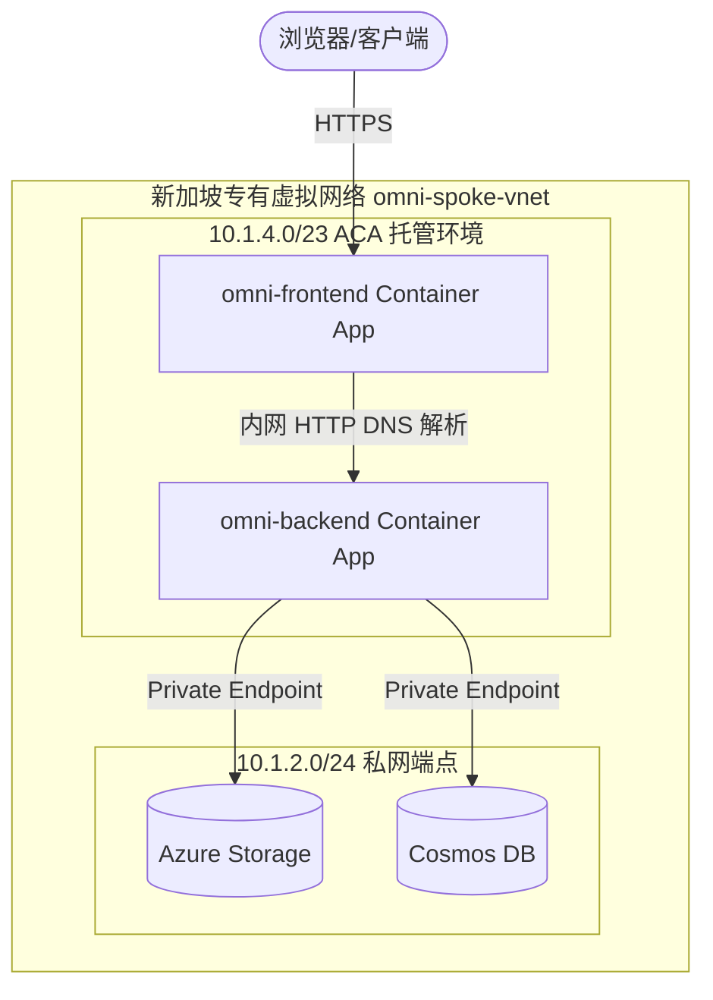

# Azure Container Apps (ACA) 架构迁移与排查复盘白皮书

本文件旨在记录 **Project-OmniGuard** 从原有的 `Static Web Apps (SWA) + Azure Functions` 服务器端无服务器架构，迁移到 `Azure Container Apps (ACA) + 专有虚拟网络 (VNet)` 独立容器化运行时的完整演进过程、技术原理、以及在迁移和调试期间踩坑的排查手册。

---

## 1. 架构演进对比

### 1.1 历史架构 (Static Web Apps + Azure Functions)
* **前端**：SWA 托管，部署在日本东区 (Japan East)。静态资源托管于 CDN，边缘路由由 Azure 托管，通过 `staticwebapp.database.json` 代理转发。
* **后端**：Azure Functions Serverless（消费计划），由 Azure 自动冷启动与回收。
* **痛点**：
  1. **跨地域网络延时**：前端在东亚/日本，后端在新加坡，公网 HTTP 握手存在 80-120ms 的地域延迟。
  2. **冷启动严重**：Serverless 触发器冷启动导致系统响应抖动。
  3. **缺乏隔离性**：公网暴露，无法放入严格的私有虚拟网络（VNet）以进行内网级别的 IP 封禁与防御。

### 1.2 全新架构 (Azure Container Apps)
我们采用专属 Bicep IaC 模板，在新加坡（Southeast Asia）重新规约了专有 VNet，实现了前/后端一站式容器化部署。

---

## 2. 核心迁移原理与网桥技术

### 2.1 内网反向代理与 DNS 合拢 (API Gateway Pattern)
为了避免浏览器跨域（CORS）问题并隐藏后端接口，我们实施了反向代理：
1. 浏览器只通过 HTTPS 访问前端的公网端点：`https://omni-frontend...`。
2. 前端服务通过容器内网的 DNS 路由，直接与后端 `omni-backend` 交换数据。
3. **内网专属 FQDN**：在 Azure Container Apps 虚拟局域网中，内网独占（`external: false`）的容器会注册为：
   `http://<app-name>.internal.<default-domain>`
   因此前端通过 `http://omni-backend.internal.ambitiousground-5964e855.southeastasia.azurecontainerapps.io` 以毫秒级延迟内网穿透直连后端。

### 2.2 无服务器运行时 (Functions Host in Container)
原先的 Python 代码是为 Azure Functions 编写的。我们通过在 Dockerfile 中引用微软官方的基础镜像 `mcr.microsoft.com/azure-functions/python:4-python3.11`，使得代码**不作任何修改**，即可在 Container Apps 容器中以常驻进程运行。这个 Functions Host 进程会在内部监听 `80` 端口，接收请求并派发给 Python 解释器。

---

## 3. 迁移期间遇到的巨坑及排查手册

在本次迁移中，我们遇到了多个层次的链路故障。以下是故障现场、原因及解决方案的总结：

| 故障现象 | 归属层级 | 根本原因 (Root Cause) | 解决方案 (Workaround) |
| :--- | :--- | :--- | :--- |
| **Bicep 报错 `InUseSubnetCannotBeUpdated`** | IaC 部署层 | 旧的 Azure Functions App 绑定了 VNet 整合，独占锁定着 `BackendSubnet` 的子网委派，阻止 Bicep 修改其 IP 范围和委派。 | 通过 `az resource delete` 强力斩断并删除了旧的 Functions App 和 App Service Plan，释放子网锁定后再次部署。 |
| **ACA 部署报错 `MANIFEST_UNKNOWN`** | ACR 镜像拉取 | 经典的“先有鸡还是先有蛋”问题。Bicep 首次拉起 Container Apps 时，我们的 ACR 还是空的，容器因找不到镜像而崩溃。 | 在 Bicep 中使用微软公网极简镜像 `aci-helloworld` 作为占位符，基础设施部署成功后，再通过本地 Docker 打包推送真实镜像覆盖。 |
| **后端容器启动报错 `AzureWebJobsStorage does not exist`** | 容器运行环境 | Azure Functions Host 进程强制要求连接存储，用作锁管理和状态跟踪，但我们没有在 ACA 环境变量中声明它。 | 在 Bicep 中动态拼装 Storage 密钥连接串注入为密文 Secret，并通过 `AzureWebJobsStorage` 环境变量挂载。 |
| **API 调用报错 `Name or service not known`** | 内网 DNS | 我们在 Bicep 中构造 Event Hub 连接串时，多写了一个 `sb://`（IoT Hub 属性自带该前缀），导致解析出了 `sb://sb://...` 双前缀地址。 | 修正 Bicep 属性拼接逻辑，移除多余的 `sb://` 协议头，使宿主进程能正确通过 DNS 解析出 Event Hub 终终点。 |
| **前端接口 500 `connect ECONNREFUSED ::1:7071`** | 编译期静态优化 (Static Baking) | Next.js 的 `next.config.mjs` 中的 `rewrites` 代理在 `npm run build` 时执行，由于当时没有运行时环境变量，它将 API 地址硬编码写死了本地端口 `7071`。 | 1. 废除 `next.config.mjs` 的编译期静态重写机制。 2. 新增 `app/api/[...path]/route.ts` 运行时动态反向代理路由并标注为 `force-dynamic`。 |
| **修改路由代码后，发布依然请求 7071** | Docker 缓存 | Docker Buildx 引擎在 Mac（Apple Silicon）上编译时，对包含中括号（如 `[...path]`）的文件夹比对失效，误判文件无改动而直接使用缓存。 | 1. 在 `sh/deploy-aca.sh` 中对前端构建强制指定 `--no-cache`。 2. 在 `az containerapp update` 更改环境变量 `TRIGGER_VERSION` 强制刷新云端 Revision。 |
| **数字人/控制台 POST 请求报 405 Method Not Allowed** | Next.js 路由 / 浏览器 HTTP 规范 | 前端发起请求未带尾随斜杠，触发 Next.js `trailingSlash: true` 配置并返回 `308 Permanent Redirect`。浏览器在重定向时自动将 `POST` 改变/降维为 `GET` 发送给内网，被后端拒绝。 | 1. 补齐前端请求的末尾斜杠，如将 `/api/chat/stream` 更改为 `/api/chat/stream/`。 2. 前端直连避免重定向。 |
| **API 动态代理在有斜杠时仍报 405 错误** | 路由路径组装 | Next.js App Router 将尾部斜杠解析为 `['chat', 'stream', '']` 空字符串。网关执行 `.join('/')` 时，多生成了 `chat/stream/`，导致后端 FastAPI 无法匹配不带斜杠的 POST 接口定义。 | 在 `route.ts` 还原路径时，使用 `pathSegments.filter(Boolean).join('/')` 过滤空字符串，规整为不带斜杠的后端地址。 |

---

## 4. 选型决策指南 (SWA+Functions vs. ACA)

既然我们已经把后端也放到了 ACA 里，**原有的 SWA + Functions 架构已经可以完全废弃了**。那么，在未来的项目架构设计中，我们该如何在这两套体系之间做出抉择？

### 4.1 核心维度对比

| 维度 | SWA + Azure Functions (Serverless) | Azure Container Apps (ACA) |
| :--- | :--- | :--- |
| **网络隔离** | 弱。前端基于 CDN 全球分发，无法封锁在私有 VNet 内；后端 Functions 需使用昂贵的 **Premium/EP 计划**才能整合进私网 VNet。 | **极强**。原生集成 VNet，前/后端容器可以被完全锁在虚拟局域网的子网内，只通过单一受控的 Ingress 端口与外网通信。 |
| **冷启动** | 较重（消费计划在闲置 20 分钟后会自动回收容器，下次请求需 5-15 秒启动）。 | **极低或零**。支持通过设置 `minReplicas: 1` 保持常驻健康副本，同时也可以缩容到 0（通过 HTTP 流量触发秒级快速拉起）。 |
| **部署与管理** | **极简**。不需要编写 Dockerfile，不需要管理基础镜像，Azure 托管编译和分发。 | **较复杂**。需要维护 Dockerfile 镜像、ACR 镜像仓库、容器多版本 Revision 的发布与回滚机制。 |
| **计费模型** | **按使用量付费**。按执行次数和内存使用时间（GB-s）计费，零请求即零费用，适合轻量低频业务。 | **按分配算力付费**。按分配给容器的 vCPU 和 Memory 常驻时间计费（若 minReplicas > 0），低频使用下成本略高于 Serverless。 |
| **计算时限** | Functions 单次 HTTP 请求最长时限为 **230 秒**。 | **无限制**。容器内可以运行长达数天甚至常驻的后台任务、Websocket 长连接。 |

### 4.2 场景推荐建议

> [!TIP]
> **优先选择 SWA + Azure Functions (Serverless) 的场景：**
> * **个人独立项目或极简原型**：需要以最快的速度上线，且不希望为数据库和服务器支付任何基础固定月租（接近免费额度）。
> * **事件驱动的批处理**：如收到图片上传后触发裁剪、用户注册后发送邮件。这些任务是瞬间触发的，无需长连接。
> * **纯静态前端展示**：没有复杂的服务端渲染 (SSR) 或频繁的内网大模型接口交互。

> [!IMPORTANT]
> **必须/推荐选择 Azure Container Apps (ACA) 的场景：**
> * **严格的私网与企业级安全合规**：前/后端需要放进 VNet，与企业内网通过 VPN/ExpressRoute 互通，且需要做复杂的网络安全组 (NSG) 隔离。
> * **长连接或常驻服务**：如需要使用 WebSockets、SSE（Server-Sent Events）做实时 AI 聊天流输出、或者长达数小时的数据清洗与后台计算。
> * **多语言与复杂依赖环境**：当你的系统依赖特定的 C++ 二进制库（如 AI 模型的 ONNX 运行时等），Serverless 环境无法安装它们，而在 Docker 镜像中你可以完全自由掌控操作系统层依赖。
