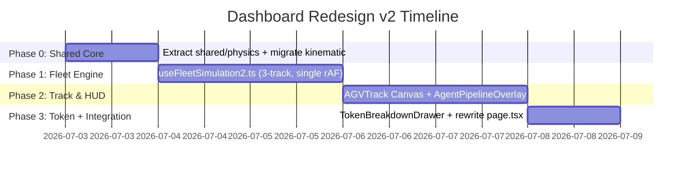

# Dashboard Redesign v2 — Fleet Kinematic-Token Control Plane (Opus Edition)
# Dashboard 重构方案 v2 — 舰队级运动学-Token 控制面（Opus 优化版）

> **Status:** Proposed · **Supersedes:** [dashboard-redesign.md](./dashboard-redesign.md) · **Aligned with:** [phase2-roadmap.md](./phase2-roadmap.md)
>
> 本文档是对原 `dashboard-redesign.md` 的专业审核与重构。它保留了原方案"舰队化 + 纯前端 + 5 秒自解释"的核心价值，但剔除其中与 `phase2-roadmap.md` 决策相冲突的内容（WAL/向量钟脑裂、SLM 降级），并补入 `phase2-roadmap.md` 已批准但原方案遗漏的关键项——LLM Token 分解。

---

## 0. 审核结论：原方案的价值与缺陷

### 0.1 原方案值得保留的部分

| 原方案主张 | 价值判断 | 依据 |
|---|:---:|---|
| Dashboard 存在"可信度问题"，需 5 秒自解释 | ✅ 准确 | 当前 [page.tsx](../../src/client-edge/src/app/dashboard/page.tsx) 的 Intent Router → Safety Firewall → Action Compiler 黑盒管线确实需要约 2 分钟口头解释 |
| 100% 纯前端仿真，消除对 Function App(7071) 的依赖 | ✅ 极高价值 | 这是单项最大收益。当前 dashboard 在后端未启动时即失效，是演示场景的致命弱点 |
| 舰队级 3 轨并行对比，强于单车可视化 | ✅ 成立 | [useCompareSimulation.ts](../../src/client-edge/src/app/kinematic/hooks/useCompareSimulation.ts) 已验证"单 `requestAnimationFrame` 驱动多轨"模式可行且无帧漂移 |
| System 1 vs System 2 双系统架构叙事 | ✅ 学术扎实 | 边缘反射 vs 云端规划，认知科学框架成熟，受众无需前置知识 |
| 移除 `CloudTopologyFlowchart` / `SandboxPanel` | ✅ 正确 | 二者与运动学-Token 定理叙事无关，属噪音 |
| 复用 `kinematic.ts` 的物理计算 | ✅ 正确方向 | 但原方案仅说"镜像"，未指定共享代码提取——本版将此明确化 |

### 0.2 原方案必须修正的缺陷

| 原方案内容 | 缺陷 | 裁决 |
|---|---|---|
| **AGV-03 "Edge-Only (WAL Sync)"** + WAL/向量钟冲突消解 | 即 `extension-analysis.md` 的 Dimension 2，已被 `phase2-roadmap.md:107-131` 以"演示认知成本过高（需先讲 WAL+向量钟+冲突仲裁才能理解 5 秒动画）"明确否决 | ❌ 移除 |
| **"Network Partition" / "Reconnection Sync" 场景** | 同上，依赖被否决的 D2 | ❌ 移除 |
| **`WALSyncConsole` 组件 + 向量钟比较算法** | 同上，~3 天工作量换低 ROI 演示 | ❌ 移除 |
| **"Local SLM Fallback" 降级模式** | 即 Dimension 1，已被 `phase2-roadmap.md:84-103` 以"1D 轨道里 SLM 与硬编码规则产生相同刹车效果，标签无演示增量"否决 | ❌ 移除 |
| **完全未提及 LLM Token 分解** | `phase2-roadmap.md:27-82` 已批准其为"下一步"（~1 天，高 ROI，补全定理公式），原方案遗漏了项目已 endorsed 的关键项 | ⚠️ 需补入 |
| 引用不存在的 `config/scenarios.ts` | 文件不存在 | ⚠️ 需新建或改用现有 config |
| 6 天时间线（含 WAL+向量钟） | 含被否决工作量，且对 WAL 复杂度偏乐观 | ⚠️ 重排 |
| "镜像" kinematic.ts 但未指定共享提取 | 两处物理计算将各存一份，违反 DRY | ⚠️ 本版明确为共享物理内核 |

### 0.3 一句话裁决

> **原方案的骨架（舰队化 + 纯前端 + 双系统叙事）是有价值的，但它的血肉（WAL/向量钟/SLM）长错了方向。本版保留骨架，替换血肉：用 LLM Token 分解填补第 3 条轨道，让整个舰队成为定理公式的三段式活体证明。**

---

## 1. 优化版核心命题

将 Dashboard 重塑为 **"运动学-Token 定理"在舰队级场景下的三段式活体证明**。

### 1.1 定理公式（完整版，含 Token 项）

$$V_{max} \le \frac{D_{clearance}}{L_{network\_rtt} + \dfrac{T_{prompt} + T_{completion}}{S_{token\_rate}} + T_{brake}}$$

分母的三项分别对应三类失控原因，而舰队的 3 条轨道各击破其一：

| 分母项 | 物理含义 | 对应轨道 | 演示结果 |
|---|---|---|---|
| $L_{network\_rtt}$ | 网络往返延时 | **AGV-01 "Cloud-Only (Lean LLM)"** | 网络 spike 时撞墙——**网络项致死** |
| $\dfrac{T_{prompt}+T_{completion}}{S_{token}}$ | LLM 生成耗时 | **AGV-03 "Cloud-Only (Verbose LLM)"** | 网络正常但生成 4000 token → 撞墙——**Token 项致死** |
| $T_{brake}$ | 硬件刹车延时 | 三车共用同一硬件常数 | 不可优化的物理下界 |
| **整体** | 全链路 | **AGV-02 "Cloud + Edge Guardian"** | Edge Guardian 把 $L_{network}+\frac{T}{S}$ 两项同时短路 → **安全刹停** |

**这是 v2 相对原方案的核心升级**：原方案的 AGV-03 讲"分布式脑裂"（需要 3 分钟前置课）；v2 的 AGV-03 讲"生成太多 token 杀死机器人"（0 秒理解，且直接落实 `phase2-roadmap.md` 已批准的 Token 分解项）。一句话演示词：

> *"同样 200ms 网络，左边车因为网络慢撞墙，右边车因为话太多撞墙，中间车因为边缘守护者把两件事都短路了而活下来。"*

### 1.2 与 /kinematic 的关系：互补而非冗余

| 页面 | 角色 | 交互模式 | 受众动线 |
|---|---|---|---|
| **/dashboard**（本方案） | 执行摘要：3 车同屏，一眼看清定理 | 场景预设按钮 + 全局滑块 | 5 秒"哇" → 讲解 30 秒 |
| **/kinematic** | 深度沙盒：单车 + 全参数可调 | 逐滑块探索 | 考官"我来试试" → 2 分钟 |
| **/kinematic/compare** | 双车对照（已存在） | cloud vs edge | 定理的二元验证 |

三者共用**同一个物理内核**（见 §4），形成"摘要 → 深度 → 对照"的演示递进。Dashboard 不复制 /kinematic 的逻辑，而是消费它导出的纯函数。

---

## 2. 设计原则

| 原则 | 工程含义 | 验收标准 |
|---|---|---|
| **5 秒自解释** | 无旁白时，3 轨颜色对比 + 撞墙/刹停动画即讲清定理 | 录屏静音播放，陌生人 5s 内能指出"哪辆会撞" |
| **纯前端零依赖** | 不调用 `/api/simulate_agent/`，离线/断网/无后端均可用 | 拔网线后页面功能完整 |
| **单源物理内核** | dashboard 与 kinematic 共用同一份刹车距离/安全包络计算 | 删除任一处的私有物理函数，引用共享模块 |
| **单 rAF 多轨同步** | 3 轨共用一个 `requestAnimationFrame`，禁用多 timer | 长跑 60s 后三轨帧数差 = 0 |
| **场景化而非参数化** | 默认呈现 4 个预设场景按钮，参数面板折叠为抽屉 | 首屏无滑块即触发有意义的演示 |
| **去黑盒化** | 不再展示 Intent Router→Safety→Action Compiler 管线 trace | 移除 `AgentOrchestratorFlow`，代之以 3-Agent 时延判定条 |

---

## 3. 架构：3-Agent 物理安全防线 + 3 轨舰队

### 3.1 3-Agent 时延分层（保留自原方案，简化表述）

| Agent | 物理角色 | 典型延时 | System 归属 | 控制台视觉 |
|---|---|---|---|---|
| ☁️ **Cloud Commander** | LLM 全局路径规划 | 200ms–30s（含 token 生成） | System 2 | 紫色节点，延时越高越暗 |
| ⚡ **Edge Guardian** | 边缘低延时安全校验 | 10–100ms | System 1 | 青色节点，触发时高亮脉冲 |
| 🛑 **Emergency Brake** | 硬件急停 | 1–15ms | 物理下界 | 红色节点，常驻 |

> **与原方案差异**：原方案将 SLM 降级塞入 Edge Guardian 的"智力降级"叙事。v2 删除该叙事——Edge Guardian 即边缘规则/SLM 的统称抽象，不区分内部实现，因为 `phase2-roadmap.md` 已判定该区分在 1D 轨道无演示价值。

### 3.2 3 轨舰队配置（v2 重新定义第 3 轨）

| 轨道 | 名称 | 配置 | 预期结果 | 证明的定理项 |
|---|---|---|:---:|---|
| **AGV-01** | Cloud-Only (Lean LLM) | `cloudLatency = 3000ms`，`completionTokens = 200`，`edge = 禁用` | 💥 撞墙（网络 spike 下） | $L_{network}$ 主导 |
| **AGV-02** | Cloud + Edge Guardian | `cloudLatency = 3000ms`，`edgeLatency = 20ms`，`completionTokens = 200` | 🛡️ 安全刹停 | Edge 短路 $L_{network}+\frac{T}{S}$ |
| **AGV-03** | Cloud-Only (Verbose LLM) | `cloudLatency = 200ms`，`completionTokens = 4000`，`tokenRate = 50 tok/s`，`edge = 禁用` | 💥 撞墙（token 生成 80s） | $\frac{T}{S_{token}}$ 主导 |

**AGV-03 是 v2 的关键创新**。它的网络延时故意设成极低（200ms，比 AGV-01 安全得多），但因为 LLM 要生成 4000 token @ 50 tok/s = 80 秒，控制环路总延时仍高达 ~80.2s，小车早已穿过整个 clearance 区。这把 `phase2-roadmap.md` 的"生成更多 Token = 杀死机器人"从单滑块体验升级为舰队并排的视觉冲击。

> **对比原方案 AGV-03**：原方案第 3 轨是"WAL 离线共识"，需讲向量钟。v2 第 3 轨是"话太多的云端 LLM"，0 秒理解，且学术上补全了定理的 Token 项——一箭双雕。

### 3.3 场景预设矩阵（精简至 4 个，全部纯前端）

在 [config/scenarios.ts](../../src/client-edge/src/app/dashboard/config/scenarios.ts)（**新建**）中定义：

| # | 场景 | AGV-01 | AGV-02 | AGV-03 | 演示一句话 |
|---|---|---|---|---|---|
| 1 | **Normal Ops** | 安全（低 RTT） | 安全 | 安全（短响应） | "一切正常时三种架构都活" |
| 2 | **Cloud Spike** | 💥 撞墙（RTT→5000ms） | 🛡️ Edge 接管刹停 | 安全（RTT 不变） | "网络炸了，只有边缘救得了" |
| 3 | **Verbose LLM** | 安全（RTT 不变） | 安全 | 💥 撞墙（completion→4000 tok） | "网络再好，话太多一样撞" |
| 4 | **Edge Disabled** | 💥 撞墙 | 💥 撞墙（edge 被关） | 💥 撞墙 | "没有边缘守护，全军覆没" |

> **删除原方案的场景**："Network Partition"与"Reconnection Sync"依赖被否决的 D2，移除。新场景 3 "Verbose LLM" 是 v2 的招牌场景，直接对应 Token 分解。

---

## 4. 架构改进：共享物理内核提取

原方案仅说 dashboard 与 kinematic "镜像同步"数学公式，未指定如何共享。v2 明确提取共享内核，消除两处私有物理函数。

### 4.1 现状（重复的物理逻辑）

- [kinematic/lib/kinematic.ts:45](../../src/client-edge/src/app/kinematic/lib/kinematic.ts#L45) `computeBrakingDistanceM(speedMps, latencyS)`
- [dashboard/lib/physics.ts:148](../../src/client-edge/src/app/dashboard/lib/physics.ts#L148) `applyPhysicsStep(...)` 内含重复的滑动距离/碰撞判定

### 4.2 目标：新建共享内核

```
src/client-edge/src/app/shared/physics/
├── kinematic-token.ts   # 定理公式 + 刹车距离 + V_max + 安全包络
└── index.ts             # re-export
```

`kinematic-token.ts` 导出纯函数（无 React、无副作用，可单测）：

```ts
// 完整定理：控制环路总延时（秒）
export function totalLoopLatencyS(p: {
  networkRttMs: number;
  promptTokens: number;
  completionTokens: number;
  tokenRateTokS: number;
  brakeLatencyMs: number;
}): number;

// 安全速度上界
export function vMaxMps(clearanceM: number, loopLatencyS: number): number;

// 单步滑动距离
export function slideDistanceM(speedMps: number, latencyS: number): number;

// 刹车距离（保留原 computeBrakingDistanceM 签名，内部迁移）
export function brakingDistanceM(speedMps: number, brakeLatencyS: number): number;
```

### 4.3 迁移影响

| 文件 | 改动 |
|---|---|
| `kinematic/lib/kinematic.ts` | `computeBrakingDistanceM` 改为从 `shared/physics` re-export，签名不变 |
| `dashboard/lib/physics.ts` | 滑动距离/碰撞判定改调 `shared/physics`；保留电池/温度等 dashboard 专属逻辑 |
| `dashboard/hooks/useFleetSimulation2.ts`（新） | 全部物理判定走共享内核 |

**收益**：定理公式只有一份实现，单测一处即保证两页数学一致；考官若质疑公式，指向单一文件。

---

## 5. 组件树（v2 修订）

```text
FleetDashboard (page.tsx, 重写)
├── FleetHeader
│   ├── 导航 (/kinematic, /kinematic/compare)
│   ├── Fleet 状态徽章 (Active / Degraded / Crashed)
│   └── 舰队延时仪表 (3 轨 max/min)
│
├── FleetControlPanel
│   ├── 场景预设按钮 (4 个，§3.3)
│   ├── 全局速度滑块 (agvSpeedMps，影响 3 轨)
│   ├── 全局 clearance 滑块 (clearanceM)
│   ├── Token 分解抽屉（折叠，默认展开 AGV-03 的 4 子滑块）
│   │   ├── networkRttMs
│   │   ├── promptTokens
│   │   ├── completionTokens
│   │   └── tokenRateTokS
│   └── ▶ Play / ⏸ Pause / ↺ Reset All
│
├── FleetTrackView (3 列 + 右侧判定条)
│   ├── AGVTrack × 3 (Canvas/SVG，共用单 rAF)
│   │   └── 每轨：车道 + AGV + 墙 + 红色"无法刹停区" + 状态徽章
│   └── AgentPipelineOverlay (右侧，替代 AgentOrchestratorFlow)
│       ├── 3-Agent 节点状态 (Cloud/Edge/Brake)
│       └── System 1/2 路由高亮线（哪层在当前接管）
│
└── FleetAuditPanel (底部)
    └── AuditTerminalConsole (重构：3 轨时间戳事件流)
```

### 5.1 组件引入/移除/保留对比（相对原方案与现状）

| 组件 | 现状 | 原方案 | v2 裁决 | 理由 |
|---|---|---|---|---|
| `PhysicalTwinVisualizer` | 存在 | 移除 | ✅ 移除 | 合并入多轨 Canvas |
| `CloudTopologyFlowchart` | 存在 | 移除 | ✅ 移除 | 与定理叙事无关 |
| `SandboxPanel` | 存在 | 移除 | ✅ 移除 | Prompt 覆盖属后端依赖功能，纯前端版不需要 |
| `AgentOrchestratorFlow` | 存在 | 升级为 `AgentPipelineOverlay` | ✅ 同原方案，但删除 SLM 降级态 | 强化 3 层时延判定 |
| `InfraTelemetryPanel` | 存在 | 简化保留 | ✅ 同原方案 | 简化为 3 轨延时 + CPU/NPU 状态 |
| `AuditTerminalConsole` | 存在 | 重构保留 | ✅ 同原方案，但**删除 WAL/向量钟输出** | 输出 3 轨物理事件，不讲脑裂 |
| `WALSyncConsole` | 不存在 | 新建 | ❌ **不建** | 依赖被否决的 D2 |
| `ControlPanel` | 存在 | 替换为 `FleetControlPanel` | ✅ 同原方案 + Token 抽屉 | |
| `AGVTrack` | 不存在 | 新建 | ✅ 新建 | Canvas 多轨 |
| `TokenBreakdownDrawer` | 不存在 | 未提及 | ✅ **新建**（v2 新增） | 落实 `phase2-roadmap.md` Token 分解 |

---

## 6. LLM Token 分解：与 phase2-roadmap 的对齐

`phase2-roadmap.md:27-82` 批准的 Token 分解原计划落在 `/kinematic` 单轨。v2 将其**提升为舰队第 3 轨的骨架**，同时在 `/kinematic` 侧保留原计划的"展开开关"作为深度探索入口。两处共享同一组参数定义（见 §7 类型）。

### 6.1 双入口分工

| 入口 | Token 分解呈现 | 受众 |
|---|---|---|
| `/dashboard` AGV-03 | 固定可见的第 3 轨，参数走场景预设 + 抽屉 | 看摘要的考官 |
| `/kinematic` | 折叠开关，4 子滑块自由调 | 动手探索的考官 |

### 6.2 参数（与 `phase2-roadmap.md:55-62` 一致）

| 参数 | 默认 | 范围 | 说明 |
|---|---|---|---|
| `networkRttMs` | 200 | 5–2000 | 纯网络往返 |
| `promptTokens` | 500 | 100–4000 | 输入上下文 |
| `completionTokens` | 1500 | 100–8000 | 输出长度 |
| `tokenRateTokS` | 50 | 10–200 | GPT-4o 典型 30–90 |

计算：`cloudLatencyMs = networkRttMs + (promptTokens + completionTokens) / tokenRateTokS * 1000`

### 6.3 公式卡双态（`FormulaCard` 升级）

| 开关 OFF（现状） | 开关 ON（v2） |
|---|---|
| `T_detect = cloudLatencyMs` | `T_detect = L_network + (T_prompt + T_completion) / S_token` |

---

## 7. 类型与配置定义

### 7.1 新增共享类型（`shared/physics/kinematic-token.ts`）

```ts
export interface LLMBreakdownParams {
  networkRttMs: number;
  promptTokens: number;
  completionTokens: number;
  tokenRateTokS: number;
}

export function computeCloudLatencyMs(b: LLMBreakdownParams): number {
  return b.networkRttMs + ((b.promptTokens + b.completionTokens) / b.tokenRateTokS) * 1000;
}
```

### 7.2 舰队轨道配置（`dashboard/config/scenarios.ts`，新建）

```ts
export type TrackId = "agv01" | "agv02" | "agv03";

export interface TrackConfig {
  id: TrackId;
  label: string;
  cloudLatencyMs: number;      // AGV-03 由 computeCloudLatencyMs 派生
  edgeLatencyMs: number | null; // null = edge 禁用
  brakeLatencyMs: number;
  llm?: LLMBreakdownParams;     // 仅 AGV-03 启用
}

export interface Scenario {
  id: string;
  label: string;
  oneLiner: string;
  tracks: Record<TrackId, TrackConfig>;
  shared: { agvSpeedMps: number; clearanceM: number; totalDistanceM: number };
}
```

---

## 8. 实施路线（去风险化，分 4 阶段）



### 8.1 阶段明细

**Phase 0 — 共享物理内核（1 天）**
- 新建 `shared/physics/kinematic-token.ts`，迁移 `computeBrakingDistanceM` + 新增 `totalLoopLatencyS` / `vMaxMps` / `computeCloudLatencyMs`。
- `kinematic/lib/kinematic.ts` 改为 re-export。
- `dashboard/lib/physics.ts` 滑动距离/碰撞判定改调共享内核。
- **验收**：`/kinematic` 与 `/kinematic/compare` 行为不变（回归测试）。

**Phase 1 — 舰队引擎（1.5 天）**
- 新建 `dashboard/hooks/useFleetSimulation2.ts`：3 轨状态 + 单 `requestAnimationFrame`，参考现有 `useCompareSimulation.ts` 的双轨模式扩展为三轨。
- 新建 `dashboard/config/scenarios.ts`：4 个场景预设。
- **验收**：无 UI 时 hook 能驱动 3 轨到预期终态（撞墙/刹停）。

**Phase 2 — 轨道与 HUD（1.5 天）**
- 新建 `AGVTrack.tsx`：Canvas 绘制车道/车/墙/红色无法刹停区。
- 新建 `AgentPipelineOverlay.tsx`：右侧 3-Agent 时延判定条，替代 `AgentOrchestratorFlow`。
- **验收**：3 轨动画与现有 `/kinematic/compare` 视觉一致，无帧漂移。

**Phase 3 — Token 分解与整合（1 天）**
- 新建 `TokenBreakdownDrawer.tsx`：4 子滑块，绑定 AGV-03 的 `cloudLatencyMs` 派生。
- 重写 `dashboard/page.tsx`：新布局，移除旧组件 import。
- 删除被取代组件文件（`PhysicalTwinVisualizer` / `CloudTopologyFlowchart` / `SandboxPanel` / `AgentOrchestratorFlow`）。
- **验收**：拔网线/无后端下，4 场景预设全部正确演示；`/kinematic` 的 Token 开关同步可用。

**总工期：~5 天**（较原方案 6 天省 1 天，且不含被否决的 D2 工作）。

---

## 9. 明确不做清单（De-scope）

| 不做项 | 原因 | 出处 |
|---|---|---|
| WAL / IndexedDB 本地日志 | Dimension 2，演示认知成本过高 | `phase2-roadmap.md:107-131` |
| 向量钟冲突消解可视化 | 同上 | 同上 |
| "Network Partition" / "Reconnection Sync" 场景 | 依赖 D2 | 本版 §0.2 |
| `WALSyncConsole` 组件 | 依赖 D2 | 本版 §5.1 |
| SLM (Phi-3) 降级可视化 | Dimension 1，1D 轨道无视觉区分 | `phase2-roadmap.md:84-103` |
| "Local SLM Fallback" 降速模式 | 同上 | 本版 §3.1 |
| 后端 `/api/simulate_agent/` 调用 | 纯前端化是本版核心目标 | 本版 §2 |

> 若未来新增 chat 语义降级面板（云端 GPT-4o vs 本地 Phi-3 回答质量对比），届时再单独规划 D1，不在本 dashboard 范围内。

---

## 10. 验收标准（Demo Readiness Checklist）

- [ ] **离线可用**：断网 + 无 Function App 时，4 场景预设全部可演示
- [ ] **5 秒自解释**：静音录屏，陌生人 5s 内能指出哪辆会撞
- [ ] **三轨同步**：长跑 60s 后三轨帧数差为 0（单 rAF 验证）
- [ ] **定理完整**：公式卡在 ON 态展示 $L_{network} + \frac{T}{S} + T_{brake}$ 三项
- [ ] **场景覆盖**：Cloud Spike 撞 AGV-01 不撞 AGV-02；Verbose LLM 撞 AGV-03 不撞 AGV-01
- [ ] **无回归**：`/kinematic` 与 `/kinematic/compare` 行为与重构前一致
- [ ] **无残留**：被移除组件文件已删除，无 dead import
- [ ] **共享内核**：`grep -r "computeBrakingDistance\|滑动距离"` 仅命中 `shared/physics`

---

## 11. 与原方案的差异速查

| 维度 | 原方案 (dashboard-redesign.md) | v2 (本文件) |
|---|---|---|
| AGV-03 定义 | Edge-Only WAL Sync（脑裂） | Cloud-Only Verbose LLM（Token 致死） |
| 第 3 轨证明的定理项 | — （讲分布式共识，与定理无关） | $\frac{T_{prompt}+T_{completion}}{S_{token}}$ |
| WAL/向量钟 | 核心组件 | 明确移除 |
| SLM 降级 | 场景内置 | 明确移除 |
| LLM Token 分解 | 未提及 | 核心特性，对齐 phase2-roadmap |
| 共享物理内核 | 仅"镜像" | 明确提取 `shared/physics/` |
| 场景数 | 4（含 2 个 D2 场景） | 4（含 1 个 Token 场景） |
| 工期 | 6 天（含 D2） | 5 天（不含 D2，含 Token） |
| 与 phase2-roadmap | 部分冲突 | 完全对齐 |

---

## 中文总结

原 `dashboard-redesign.md` 的**骨架是对的**——舰队化、纯前端、5 秒自解释、System 1/2 叙事——这些都应该做。但它的**血肉长错了**：第 3 轨去讲 WAL/向量钟脑裂，正好撞上 `phase2-roadmap.md` 已经否决的 Dimension 2；又塞进 SLM 降级，撞上被否决的 Dimension 1。

v2 做了两件事：
1. **砍掉** WAL/向量钟/SLM 这些被否决的血肉；
2. **用 LLM Token 分解重铸第 3 轨**——让 AGV-03 成为"话太多的云端 LLM 撞墙"的活体证明，直接落实 `phase2-roadmap.md` 已批准但原方案遗漏的 Token 分解项。

结果：3 条轨道各击破定理分母的一项（$L_{network}$ / $\frac{T}{S}$ / Edge 短路两者），整个舰队就是定理公式的三段式活体证明。工期更短（5 天 vs 6 天），学术更完整（定理三项全覆盖），演示更直观（0 秒理解 vs 3 分钟前置课），且与项目既有战略决策完全对齐。
