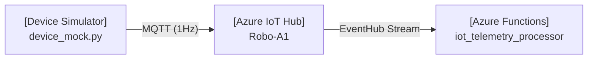

# 🌐 Edge Simulator 调试与双端联调运行指南

本指南详细阐述如何从零开始配置并运行物理设备模拟器与云端控制面（Azure Functions）的本地双端联调。

## 1. 神经通信架构流向

双端联调的数据流流向如下：


- **边缘端 (Edge)**：[device_mock.py](file:///Users/liushengwei/project/PythonProject/Project-OmniGuard/src/cloud-orchestrator/edge-simulator/device_mock.py) 建立 MQTT 双向长连接，每秒持续上报设备坐标与避障遥测数据。
- **云控制端 (Cloud)**：[function_app.py](file:///Users/liushengwei/project/PythonProject/Project-OmniGuard/src/cloud-orchestrator/function_app.py) 中的 [iot_telemetry_processor](file:///Users/liushengwei/project/PythonProject/Project-OmniGuard/src/cloud-orchestrator/function_app.py#L46) 函数通过 Event Hub 触发器实时监听并解析物理探针上报的遥测信号。

---

## 2. 准备工作

确认本地环境中已安装以下核心工具：
1. **Python 3.11+** （包含已建立的虚拟环境：`src/cloud-orchestrator/.venv`）
2. **Azure CLI**（确保已执行 `az login` 登录对应订阅）
3. **Azure Functions Core Tools** (`func` CLI 4.x 版本以上）

---

## 3. 从零运行步骤

### Step 1: 基础设施检查
确保 Azure 中的 IoT Hub 与资源组已成功部署。如果需要从零新建，请在根目录执行：
```bash
make provision
```

### Step 2: 注册设备并提取凭证 (自动配置)
在根目录下运行以下命令，强制注册物理探针 `Robo-A1`，脚本会自动完成双端凭证同步：
```bash
make add-device DEV=Robo-A1
```

> **自动化底层细节说明：**
> 1. **边缘端同步**：自动查询 `Robo-A1` 设备专属的 `Device Connection String`，并写入至边缘模拟器配置文件 [src/cloud-orchestrator/edge-simulator/.env](file:///Users/liushengwei/project/PythonProject/Project-OmniGuard/src/cloud-orchestrator/edge-simulator/.env)。
> 2. **后端同步**：自动查询 IoT Hub 的 Event Hub 兼容连接串，注入至后端配置文件 [src/cloud-orchestrator/local.settings.json](file:///Users/liushengwei/project/PythonProject/Project-OmniGuard/src/cloud-orchestrator/local.settings.json) 的 `IotHubEventHubConnectionString` 中。

---

## 4. 双端联调本地启动

在两个独立的终端窗口中分别运行后端与模拟器：

### 终端 1：启动云端后端 (Azure Functions)
在根目录下运行以下命令，启动本地的 Functions 宿主进程：
```bash
make start-backend
```
> [!NOTE]
> 成功启动后，控制台会输出 Event Hub 触发器加载成功的信息，并进入事件监听就绪状态。

### 终端 2：启动物理模拟器
进入模拟器目录并使用配套虚拟环境 Python 运行：
```bash
cd src/cloud-orchestrator/edge-simulator
../.venv/bin/python device_mock.py
```
> [!IMPORTANT]
> 如果在 macOS 环境下初次运行遭遇 `ssl.SSLCertVerificationError` 证书报错，请先在终端运行以下系统命令修复：
> `bash "/Applications/Python 3.11/Install Certificates.command"`

---

## 5. 核验遥测通路 (Verification)

当双端均成功运行后，观察**终端 1（Functions）** 的日志输出。应能实时观察到类似下方的脑干激活日志：

```text
[⚡️ 脑干激活] 接收到来自物理探针 Robo-A1 的神经信号。
[📊 状态解析] X坐标: 0 | 障碍物距离: 42cm
[⚡️ 脑干激活] 接收到来自物理探针 Robo-A1 的神经信号。
[📊 状态解析] X坐标: 1 | 障碍物距离: 42cm
```
若能稳定打印上述解析数据，代表 **Step 1: 物理长连贯通** 顺利达成。

---

## 6. 常见故障排查 (Troubleshooting)

### 问题 1: Functions 启动失败，提示 `Storage account connection string 'AzureWebJobsStorage' does not exist`
* **原因**：Azure Functions Local Runtime 依赖 `AzureWebJobsStorage` 管理事件租赁和分区的检查点（Checkpoint）。
* **修复方法**：在 [local.settings.json](file:///Users/liushengwei/project/PythonProject/Project-OmniGuard/src/cloud-orchestrator/local.settings.json) 文件的 `Values` 对象中添加 `AzureWebJobsStorage` 连接串。

### 问题 2: Functions 启动后监听触发器报错 `Status: 403 (This request is not authorized to perform this operation.)`
* **原因**：Azure 存储账户的网络访问策略处于关闭状态（`publicNetworkAccess: Disabled`）或开启了防火墙且当前本机的 IP 地址未被加入白名单。
* **修复方法**：运行以下 Azure CLI 命令以启用公共网络访问并将默认动作设为 `Allow`，或者单独将本机的公网 IP 添加进网络规则中：
  ```bash
  # 开启存储账户的公共网络访问
  az storage account update --name <StorageName> -g omni-guard-infra-sea-rg --public-network-access Enabled
  # 临时放行所有公共流量（或使用 network-rule add 仅放行本机公网 IP）
  az storage account update --name <StorageName> -g omni-guard-infra-sea-rg --default-action Allow
  ```

